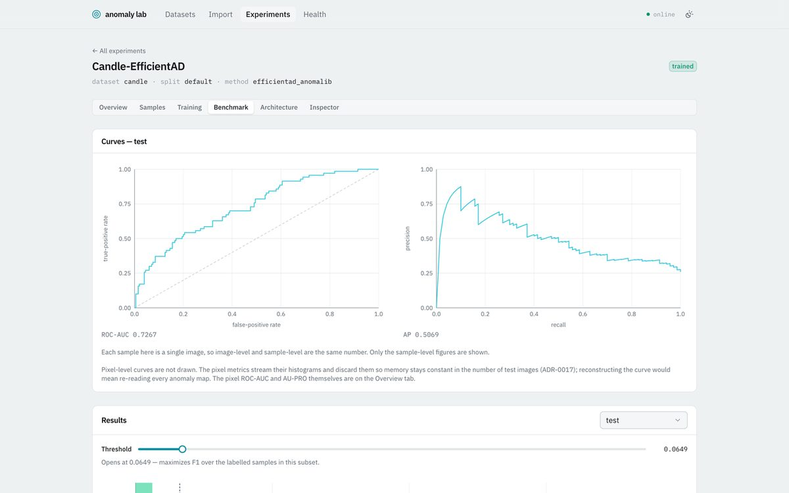
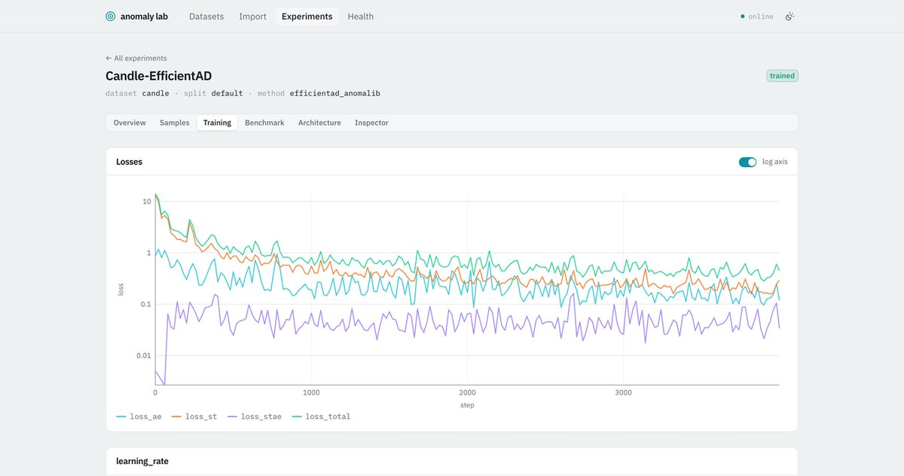

# visual-anomaly-lab

**A local desktop workbench for visual anomaly detection.** Point it at a folder of images, train
several methods on them, and compare what they found — same samples, same split, same metrics.

Everything runs on your machine. No cloud, no accounts, no telemetry. Source images are read where
they are and never copied anywhere.


---

## Quick start

You need [`uv`](https://docs.astral.sh/uv/), [`bun`](https://bun.sh/), and a Rust toolchain. On macOS
also `xcode-select --install`. Nothing else — `uv` fetches its own Python.

```bash
git clone git@github.com:VitalyVorobyev/visual-anomaly-lab.git
cd visual-anomaly-lab

uv sync --directory backend --extra dl   # drop --extra dl to skip the deep methods
cd frontend && bun install && cd ..

./scripts/dev-app.sh
```

Then, in the app:

1. **Import** — point it at a directory of images. It proposes a manifest; review it and commit.
2. **Label & split** — mark samples, or adopt a benchmark's published split.
3. **New experiment** — pick a dataset, a split and a method.
4. **Train**, then **Score & evaluate**.
5. Look at what it found.

If you have no dataset to hand, [VisA](#reference-datasets) is a good first one and takes a few
minutes end to end with `pixel_reference`.

## What you get

### Every scored sample, filterable by what went wrong

The **Samples** view ranks the whole subset by anomaly score and filters it by outcome. *Mistakes*
is false positives and false negatives together — usually the first thing worth looking at.

In the screenshot above, the worst false positive in the run is a clean part whose shadowed rims
light up. The overlay says so at a glance.

### One sample, up close

Three layers over the photograph, and they answer different questions. The **heatmap** says how
anomalous, everywhere. The **prediction** is the model's own segmentation — where it crossed a
threshold, with an edge. The **ground truth** is what was annotated. Laid together, agreement and
disagreement are visible directly.


Arrow keys step through the filtered set; scroll to zoom, drag to pan.

### Metrics you can check



Threshold-independent metrics are computed once and stored. Anything that depends on a threshold —
the confusion matrix, precision, recall, the FP and FN lists — is recomputed as you move the slider,
so it behaves like a filter rather than a commitment. Pixel-level ROC-AUC and AU-PRO appear whenever
a dataset ships masks.

**A metric that could not be computed shows a dash, never a zero.** A subset with no defects has no
ROC-AUC, and a fabricated number is worse than a visible gap.

### What the model is doing



Losses stream live and survive a reload. The **Architecture** view is read from a real forward pass
rather than drawn by hand, so it cannot go stale against the model it describes, and the
**Inspector** shows whatever intermediate pictures a method chose to record.

## Methods

| Method | What it is | Needs |
| --- | --- | --- |
| `pixel_reference` | Per-pixel median + MAD over the training normals → z-map → smoothing → high-percentile score. Trains in seconds and gives every deep result something to beat. | numpy, Pillow |
| `efficientad_anomalib` | EfficientAD via Intel's [anomalib](https://github.com/open-edge-platform/anomalib). Trains on Apple Silicon through MPS. | `--extra dl` |
| `efficientad_custom` | The same paper ([arXiv:2303.14535](https://arxiv.org/abs/2303.14535)), implemented here. The wrapper above is the baseline it is measured against, not a specification it copies — see [ADR-0029](docs/adr/0029-anomalib-is-the-baseline-not-the-specification.md). Needs torch alone, not anomalib. | `--extra dl` |
| `patchcore_anomalib` | PatchCore ([arXiv:2106.08265](https://arxiv.org/abs/2106.08265)) via anomalib. Nothing is trained: a frozen backbone's patch features are greedily reduced to a coreset memory bank, and a test patch is scored by its distance to the nearest vector in it. | `--extra dl` |
| `dinomaly_anomalib` | Dinomaly ([arXiv:2405.14325](https://arxiv.org/abs/2405.14325)) via anomalib. A frozen DINOv2 encoder and trainable transformer decoder reconstruct normal features; their disagreement produces the anomaly map. | `--extra dl` |

Running the two EfficientADs against each other on one split is the point of having both: every
improvement in the custom one is a configuration field, so it is an ablation the comparison screen
can show you rather than a claim you have to take on trust.

**The teacher is one of those fields, and it turned out to be the most important one.** EfficientAD
distils a student against a small pretrained network, and the two published versions of that network
are different — same architecture, weights differing tensor by tensor. Swapping which one is loaded
moved AU-PRO from 0.560 to 0.914 at a fixed budget on VisA `candle`, three seeds each, which is
larger than the effect of seven times more training. So `teacher_source` picks between them, and
`anomaly-lab distill` **produces one here** from a frozen WideResNet-101 — see
[teacher-distillation.md](docs/teacher-distillation.md) for the exact commands and
[ADR-0031](docs/adr/0031-the-teacher-is-an-experiment-variable-and-we-produce-it.md) for why.

Distillation changes nothing about inference: the large model is training-only, and what a trained
experiment loads and runs is the same 2.7M-parameter network it always was.

**PatchCore is the one whose cost is memory rather than time**, and its defaults were measured rather
than guessed. A ~900-image class generates 5.66 GB of patch embeddings before any selection, so the
bank is bounded by two caps — one on images read, one on vectors held — resolved and printed *before*
the pass rather than discovered by a machine that has started swapping. `scripts/patchcore-smoke-test.py`
is what produced the numbers, and re-running it on a different machine is how you check them.

A method is a Python module and a registry entry — no routes, no schemas, and no TypeScript, because
the configuration form is generated from the method's own schema. PatchCore is the strongest evidence
for that claim so far: it has no training steps, no gradients and nothing to resume, and it still cost
exactly one entry.

## Reference datasets

Datasets are not included. Download either pack into the gitignored `/datasets/` directory; the dataset
catalogue detects a complete local pack and offers one **Register** action. Registration indexes the files
in place and never copies or modifies them. Any other image tree still goes through the general import
screen.

| Dataset | What it is | Adapter | Licence |
| --- | --- | --- | --- |
| [**VisA**](https://github.com/amazon-science/spot-diff) — Zou et al. | 12 object classes, ~1000 normal + 100 anomalous images each, **with pixel-level masks** and official split tables. | `csv_table` | CC BY 4.0 |
| [**GKN Blade Surface Defect**](https://doi.org/10.17632/3bh998k78g.1) — Qianyu Zhou, University of Connecticut | 203 good, 48 nick, 149 scratch photographs of blade surfaces. No masks. | `folder_classes` | CC BY 4.0 |

VisA registration creates one dataset per object class from `split_csv/1cls.csv`; GKN maps `Good` to
normal and `Nick` / `Scratch` to defect. Those are provider defaults, not assumptions in the domain model
or either adapter.

Then create a split with the **`imported`** strategy to adopt the published partition rather than
drawing your own — that is what makes your number comparable to the paper's.

## How it fits together

- **UI** — React + TypeScript in a [Tauri](https://tauri.app/) shell. The shell is thin: it starts
  the backend, hands over the port, and shuts it down on exit.
- **Backend** — a Python FastAPI process on `127.0.0.1`, with no Tauri dependency, so the same UI
  also runs in a plain browser against a manually started backend.
- **Jobs** — import, training and inference each run as a subprocess off a single queue, streaming
  progress over a WebSocket, cancellable, and recovered after a crash.
- **Storage** — SQLite for metadata, scores and paths; anomaly maps, checkpoints, thumbnails and
  logs on the filesystem under `data/`. Delete that directory to reset the application.
- **Compute** — Apple Silicon / MPS. No CUDA assumption, one job at a time.

Anomaly maps are stored raw. Colormap, threshold, opacity and segmentation are all applied when the
picture is drawn, so those choices stay changeable after the expensive computation is done.

## Running in a browser

The backend does not depend on the desktop shell, and the browser path is fully supported:

```bash
./scripts/dev-backend.sh    # FastAPI on :8000
./scripts/dev-frontend.sh   # Vite on :5173
```

Open <http://localhost:5173>. Interactive API docs are at <http://127.0.0.1:8000/docs>.

One thing the browser cannot do is open a folder in your file manager, so where the desktop app
offers *Reveal in Finder*, the browser shows the path as selectable text.

## Contributing

Development setup, the check suite, architecture decisions and the roadmap are in
[`docs/development.md`](docs/development.md).

## Credits

The reference datasets are licensed separately by their authors, as credited above. The screenshots
in this README show VisA imagery (CC BY 4.0).
