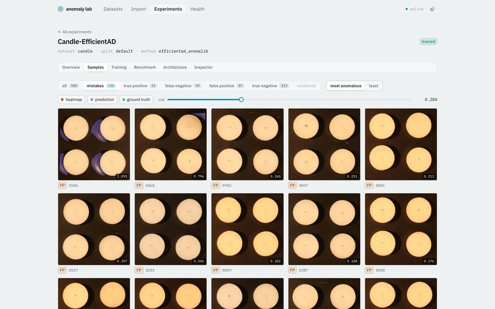
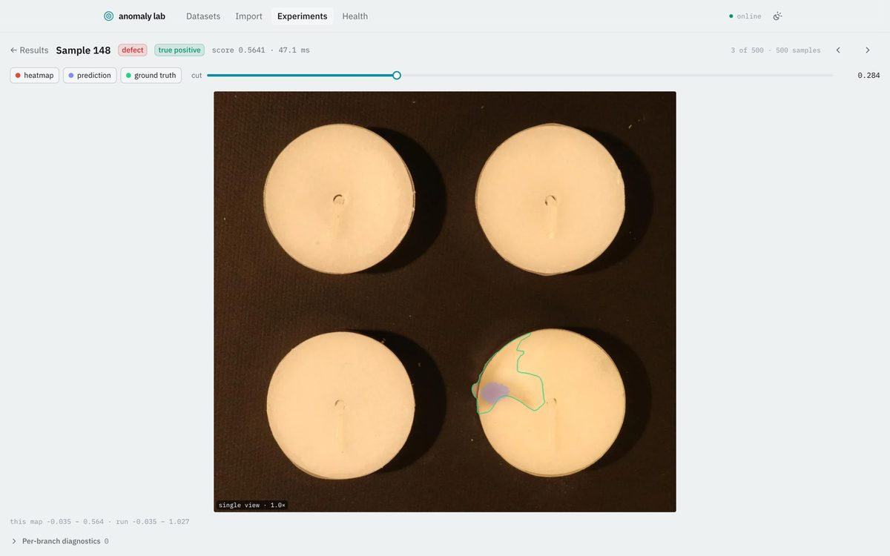

# Visual Anomaly Lab

**A local desktop workbench for visual anomaly detection.** Bring an image dataset, annotate defects,
prepare object regions, train several methods, inspect their mistakes, compare them under one protocol, and
export a proven model to ONNX for a Rust consumer.

Everything runs on your machine. There are no accounts, cloud services, or telemetry. Source images are
indexed where they already live and are never copied into the application workspace.



## Five-minute start

You need [uv](https://docs.astral.sh/uv/), [Bun](https://bun.sh/), Rust, and—on macOS—Xcode command-line
tools.

```bash
git clone https://github.com/VitalyVorobyev/visual-anomaly-lab.git
cd visual-anomaly-lab
uv sync --directory backend --extra dl
(cd frontend && bun install)
./scripts/dev-app.sh
```

Omit `--extra dl` for a smaller install with the statistical baseline and every non-deep workflow.

In the app:

1. Open **Datasets** and register a local VisA pack, or import your own image tree.
2. Review labels and masks; annotate missing defects when needed.
3. Adopt the provider's split or create a seeded sample-level split.
4. Start a `pixel_reference` experiment, train it, then score the test subset.
5. Open **Samples**, filter to **Mistakes**, and inspect what the model actually found.
6. Add PatchCore or another method and compare runs from the same dataset workspace.

The complete walkthrough is in the **[Visual Anomaly Lab book](docs/book/introduction.md)**, beginning with
[Quick start](docs/book/quick-start.md) and [A new dataset, end to end](docs/book/new-dataset.md).

## What the workbench gives you

- **Dataset-centered workflow.** Browse images, annotations, splits, region profiles, experiments, and
  experiment history from one dataset workspace. Filter history by method, status, split, or search text.
- **Source-frame annotation editor.** Polygon and region editing, undo/redo, automatic contour proposals,
  1:1 and fit views, double-click fit/restore, and direct drag-to-pan without a separate pan mode.
- **Object-region experiments.** Identity, classical localization, and MobileSAM-backed region profiles are
  versioned and pinned to experiments so preprocessing remains reproducible.
- **Several method families.** A transparent statistical floor, EfficientAD implementations, a bounded
  PatchCore memory bank, transformer reconstruction with Dinomaly, and experimental learned synthesis.
- **Evidence, not only scores.** Image and pixel metrics, source-frame maps, threshold exploration,
  false-positive/false-negative galleries, intermediate diagnostics, resource plans, and full job logs.
- **Honest comparison.** Runs share dataset and split; threshold-independent metrics compare directly, while
  each run resolves its own operating point because raw score units are not interchangeable.
- **Verified deployment.** Supported fitted methods export as checksummed ONNX bundles with deterministic
  parity fixtures and an independent Rust/ONNX Runtime reference consumer.



## Included methods

| Family | Methods | Current role |
|---|---|---|
| Statistical reference | `pixel_reference` | Fast CPU floor; ONNX export |
| Student–teacher + reconstruction | `efficientad_anomalib`, `efficientad_custom` | Compact deep references; both export to ONNX |
| Feature memory bank | `patchcore_anomalib` | Short bounded fit; bank and paper score export to ONNX |
| Transformer reconstruction | `dinomaly_anomalib` | High-quality public-data reference; longer fit; ONNX export |
| Learned anomaly synthesis | `glass_anomalib` | Experimental; public gate did not promote it; ONNX export |

See the generated [method catalogue](docs/book/generated/methods.md),
[selection guide](docs/book/model-selection.md), and checked
[public benchmark report](docs/book/generated/benchmarks.md) for capabilities, limitations, plots, and the
evidence behind those roles.

## Public reference data

Datasets are not bundled. Place downloads under the gitignored top-level `datasets/` directory and the app
offers a one-click registration when it recognizes a complete pack. Registration reads files in place.

- [VisA](https://github.com/amazon-science/spot-diff)—12 industrial object classes with official one-class
  splits and pixel masks, CC BY 4.0.
- [GKN Blade Surface Defect Dataset](https://doi.org/10.17632/3bh998k78g.1)—good, nick, and scratch images,
  CC BY 4.0.

Use the imported split to compare with a provider protocol. Any other tree can use the configurable CSV,
folder-class, or multi-channel adapters.

## Browser mode

The desktop shell is thin. For browser-based development or use:

```bash
./scripts/dev-backend.sh
./scripts/dev-frontend.sh
```

Open <http://localhost:5173>. Interactive API documentation is at <http://127.0.0.1:8000/docs>.

## Documentation

- **[The book](docs/book/introduction.md):** user workflows, full pipelines, method choice, benchmarks,
  ONNX/Rust deployment, and extension guides.
- **[Architecture handbook](docs/architecture/README.md):** the canonical description of current internals.
- **[Development](docs/development.md):** contributor setup, checks, safety, and evidence workflows.
- **[Roadmap](docs/roadmap.md):** shipped milestones and remaining exit criteria.

Build the local HTML book with `mdbook build` and open `book/index.html`.

## Scope

Visual Anomaly Lab is a research workbench, not a production-line reject controller. It assumes one trusted
local user and trusted model code. Production integration begins from a verified export and must separately
validate source-image preparation, target execution provider, latency, memory, and hardware parity.

## Credits

Reference datasets remain under their authors' licences. Screenshots in this README use VisA imagery
(CC BY 4.0). Model implementations build on the cited papers and, where named, Intel's
[anomalib](https://github.com/open-edge-platform/anomalib).
