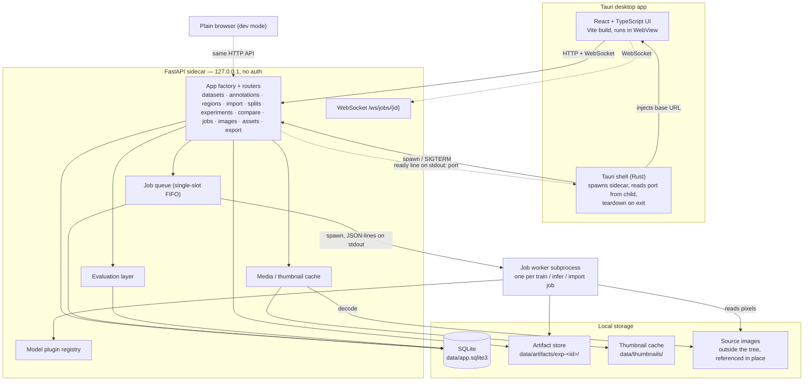

# The handbook

**How `visual-anomaly-lab` works, now.** These pages carry no status and no date; they describe the system
as it currently is and are edited whenever it changes. *Why* it is shaped this way is in
[`docs/adr/`](../adr/) — when a page and a record disagree, **the page is right about what the code does and
the record is right about what was chosen** (ADR-0030).

| Page | What it covers |
|---|---|
| [Overview](#overview) *(below)* | The loop, the non-goals, the four constraints, the component map |
| [Repository](repository.md) | Where everything lives on disk |
| [Domain model](domain-model.md) | `Dataset`, `Sample`, `Image`, `Split`, `Experiment` and the rest |
| [Annotations](annotations.md) | Source-mask provenance, editable drafts, immutable revisions |
| [Import](import.md) | Adapters, the reviewable manifest, scan and commit, re-import, `verify` |
| [Methods](methods.md) | The plugin interface, capability flags, contexts, preprocessing, device policy |
| [Diagnostics](diagnostics.md) | What a method shows about itself, and the two ways to read it |
| [Jobs](jobs.md) | The queue, the subprocess protocol, resume, and the one process that is not a job |
| [Evaluation](evaluation.md) | Aggregation, image- and pixel-level metrics, thresholds, rankings |
| [Portable deployment](deployment.md) | Verified ONNX bundles, parity, and the Rust-consumer boundary |
| [Media](media.md) | Thumbnail and preview cache, ETags, the full-resolution tier |
| [Frontend](frontend.md) | Stack, the token layer, shell capabilities, every screen |
| [Security](security.md) | The local attack surface, and what is deliberately not defended |

What works today and what is open is in [`roadmap.md`](../roadmap.md) and [`backlog.md`](../backlog.md);
the gates and their numbers are in [`measurements.md`](../measurements.md); procedures for users and
extenders are in the book (`book/src/`).

---

## Overview

`visual-anomaly-lab` is a **local desktop research workbench** for visual anomaly detection, aimed at being a
*universal* explorer for arbitrary image datasets. The showcase dataset (images of a manufactured circular
part) is one reference dataset, not the scope; only an optional classical baseline may exploit its geometry.
Several methods are trained, evaluated and compared on the *same* dataset under the *same* evaluation
protocol, with results that are persisted, reopenable and reproducible.

| Stage | What the user does |
| --- | --- |
| **Import** | Point the app at a folder of images; review a proposed manifest; commit it into the catalog. |
| **Label & split** | Label samples, version source-frame defect masks, create train/val/test splits. |
| **Train** | Create an experiment (dataset + split + method + config + preprocessing) and run it as a job with live progress and logs. |
| **Infer** | Score a subset or individual samples, producing per-image scores and anomaly maps. |
| **Evaluate** | Threshold-independent metrics, an interactive threshold, FP/FN inspection, ranked lists. |
| **Compare** | Put several experiments side by side under one protocol. |
| **Export** | Publish a supported fitted method as a checksummed ONNX bundle after parity. |

## Non-goals

- production-line integration or automatic accept/reject decisions,
- authentication, user accounts or multi-user access (ADR-0022, [security](security.md)),
- cloud deployment or remote compute,
- distributed training,
- real-time camera acquisition,
- collaborative annotation; annotation editing is local and single-user.

One user, one machine, one job at a time: **a small, understandable architecture over premature
scalability**.

## Design constraints

1. **Dataset-agnostic core.** The domain model, import layer, DL methods and evaluation layer assume
   nothing about a dataset's geometry, and the number of acquisition channels is per-dataset data, never
   hard-coded (ADR-0005).
2. **Grouped samples are first-class.** A logical sample (one physical part) may carry several images.
   Labels and split membership live on the *sample*, never on the image, so all views of a part share a
   subset.
3. **Private data never leaves the machine** (ADR-0022). Source images live **outside the repository
   working tree** and are referenced in place, read-only; git cannot stage what is not under the working
   directory.
4. **Apple Silicon / MPS** is the target compute device; there is no CUDA assumption.

---

## Component architecture



## Components

**React + TypeScript UI (WebView).** All application screens ([frontend](frontend.md)). A pure
HTTP/WebSocket client with no privileged capability and no Tauri-only API for core functionality; job
progress arrives over WebSocket. It reads its backend base URL from the value the shell injects, falling
back to `http://127.0.0.1:8000` so the same bundle runs in a browser.

**Tauri shell (Rust).** Thin desktop wrapper whose entire job is process lifecycle (ADR-0003):

- **find `uv` by absolute path.** An app launched from Finder inherits `/usr/bin:/bin:/usr/sbin:/sbin`,
  which holds no `uv`. The shell tries `ANOMALY_LAB_SIDECAR_CMD`, then every `PATH` entry, then
  `~/.local/bin` and the Homebrew and MacPorts directories, and reports every path it tried when none
  holds an executable. It also checks the checkout is still where the build recorded it
  (`ANOMALY_LAB_REPO_ROOT` overrides);
- **spawn the sidecar** with the data directory in its environment and `ANOMALY_LAB_PORT=0`, then **read
  the port back from the child**: the sidecar binds the socket itself and announces
  `{"ev":"ready","port":N,"pid":N}` as one JSON line on stdout (the ADR-0009 envelope). The OS-chosen port
  is never released between choosing and serving, so there is no bind → close → re-bind race;
- **build the window only once the sidecar is ready**, injecting the base URL as `window.__ANOMALY_LAB__`
  before the page loads, so the UI needs no retry-on-boot logic (ADR-0012);
- **build the window anyway when the backend did not start**, injecting `startupError` — the cause, the
  paths searched and the backend's last lines of output — for the page to paint ([frontend](frontend.md)).
  Nothing in the setup hook may return an error: on macOS it runs inside `did_finish_launching`, where a
  panic becomes `abort()` with no window;
- **tear down on exit** — `SIGTERM` to the child's process group, a grace period, then `SIGKILL`; the
  sidecar in turn terminates any running job worker. Closing the last window quits the application.

Stdout carries structured events, so the sidecar logs to **stderr**, and the shell drains **both** pipes
for the life of the process — a child whose pipe fills up blocks on write.

macOS has no `PDEATHSIG`, so none of this runs when the shell is force-quit or crashes. The sidecar
therefore **watches its parent itself**: given `ANOMALY_LAB_PARENT_PID` it probes that pid with signal 0
and exits when it disappears. It probes the recorded pid rather than `os.getppid()` because `uv run` sits
between the shell and the interpreter. This watchdog is what guarantees no orphaned Python process
survives an app crash.

The shell also provides native file and folder pickers for import, since a browser cannot return a
server-visible absolute path.

**FastAPI sidecar.** The entire backend. Bound to `127.0.0.1` only, no authentication ([security and privacy](security.md)). Routers:

| Router | Prefix | Responsibility |
| --- | --- | --- |
| `datasets` | `/api/datasets` | dataset CRUD and deletion preview, channel dictionary, sample listing/filtering, label edits |
| `annotations` | `/api/datasets/…/annotation-labels`, `/api/images/…/annotations` | label taxonomy, optimistic draft editing, immutable revisions, PNG/LabelMe/COCO import and export |
| `import` | `/api/import` | `scan` (produce manifest) and `commit` (create rows); `verify` re-check |
| `reference_packs` | `/api/reference-packs` | discover complete local VisA/GKN/FSS-1000/PKU-Market-PCB packs and register missing datasets atomically |
| `splits` | `/api/splits` | create/list seeded or imported splits, per-subset counts, assignments |
| `region_profiles` | `/api/region-extractors`, `/api/region-profiles` | extractor catalogue, immutable profiles, bounded preview/build, prepared images and guarded revision deletion |
| `segment_assist` | `/api/segment-assist`, `/api/images/…/segment-assist` | MobileSAM readiness and temporary prompt-guided mask suggestions |
| `explore` | `/api/explore`, `/api/images/…/explore` | which frozen encoders can run, and what one sees in an image: similarity, clusters, false colour, a mask as a candidate |
| `experiments` | `/api/experiments` | a package of four modules on one prefix: `crud` (model catalogue/schema, search, create/detail/delete), `runs` (train/infer/export, re-evaluate), `results` (rankings, thresholds, curves, previews, artifacts) and `diagnostics`; `views` holds their shared read models |
| `compare` | `/api/compare` | compatible multi-run metrics, operating points and per-sample agreement |
| `jobs` | `/api/jobs`, `/ws/jobs/{id}` | status, cancel, metrics, log tail and live progress for generic background work |
| `images` | `/api/images` | thumb / preview / full pixel delivery, prepared previews and anomaly-map PNG rendering |
| `model_assets` | `/api/model-assets` | licensed asset catalogue, verified install/external source and app-owned removal |
| `health` / `ws` | `/api/health`, `/ws/echo` | liveness, version/database state and transport diagnostics |

**Routers present; services decide.** The two routers with the most orchestration hand it to a service:
`annotations/service.py` (drafts, revisions, scope, interchange) and `experiments/service.py` (creation,
preconditions for resume/export/diagnosis, deletion ordering, the resident and queue guards, raw values
and stored diagnostics). A route reads its parameters and headers, calls one service function and shapes
the answer — status, `ETag`, bytes; transactions, file writes and every refusal live in the service.

**Refusals are domain errors, mapped once.** Code below the routers says *no* by raising a subclass of
`anomaly_lab.errors.DomainError` with a `detail` a person can act on. `api/errors.py` maps each class to its
status in one table — `UnsupportedRequestError` 400, `NotFoundError` 404, `ConflictError` 409, `GoneError`
410, `StaleVersionError` 412, `InvalidInputError` 422, `UnavailableError` 503 — and renders it as FastAPI
renders an `HTTPException` (`{"detail": …}`), so a refusal can move between router and service without a
client noticing. An exception joins a category by inheriting from it: `GroundTruthDriftError` is a
`ConflictError`, so every route that reads truth answers 409. `HTTPException` remains for what is only
HTTP — a missing `If-Match` header is 428.

**Model plugin registry.** A name → class dictionary of methods (ADR-0007) whose keys are persisted in
`Experiment.model_type`: `pixel_reference`, `efficientad_custom`, `patchcore_anomalib`, `dinomaly_custom`,
`glass_anomalib`, `dino_memory`, `subspace_ad`. Adding a method means adding a module and a registry entry
— nothing else in the application changes ([methods](methods.md)).

**Storage.** SQLite at `data/app.sqlite3` holds metadata, configuration, scores and paths
([domain model](domain-model.md)); the artifact store at `data/artifacts/exp-<id>/` holds method state,
anomaly maps, logs and exports; the thumbnail cache is `data/thumbnails/` ([media](media.md)). Source images
live outside the repository and are read-only: the backend decodes them and never writes to that tree
(ADR-0022).

## Standalone backend

The sidecar has **no dependency on Tauri** (ADR-0003). During development it runs directly:

```
uv run --directory backend uvicorn anomaly_lab.api.app:create_app --factory --reload --port 8000
```

and the React app runs under `vite dev` against it. Every feature is exercisable from a plain browser, so
the Python and TypeScript halves are independently testable.

CORS is permitted in dev mode only, and covers `http://localhost:*` and `http://127.0.0.1:*` **plus
`tauri://localhost` and `http://tauri.localhost`** — the Tauri v2 WebView origins, which a rule written
for localhost ports would miss.

`scripts/dev-backend.sh` (the command above), `scripts/dev-frontend.sh` (Vite against it) and
`scripts/dev-app.sh` (the full desktop app) wrap the three ways to run the system.
