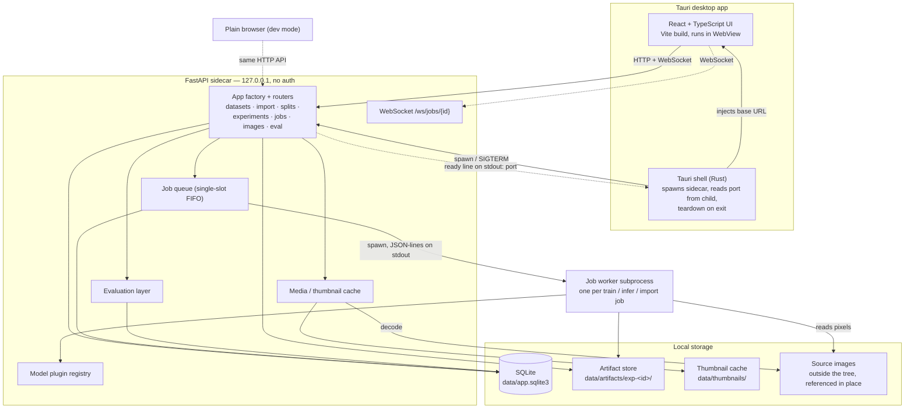

# The handbook

**How `visual-anomaly-lab` works, now.** These pages carry no status and no date; they are edited
whenever the system changes and describe it as it currently is. *Why* it is shaped this way is in
[`docs/adr/`](../adr/) — and when a page and a record disagree, **the page is right about what the
code does and the record is right about what was chosen** (ADR-0030).

| Page | What it covers |
|---|---|
| [Overview](#overview--goals) *(below)* | The loop, the non-goals, the four constraints, the component map |
| [Repository](repository.md) | Where everything lives on disk |
| [Domain model](domain-model.md) | `Dataset`, `Sample`, `Image`, `Split`, `Experiment` and the rest |
| [Annotations](annotations.md) | Source-mask provenance, editable drafts, immutable revisions |
| [Import](import.md) | Adapters, the reviewable manifest, scan and commit, re-import, `verify` |
| [Methods](methods.md) | The plugin interface, capability flags, contexts, preprocessing, device policy |
| [Diagnostics](diagnostics.md) | What a method shows about itself, and the two ways to read it |
| [Jobs](jobs.md) | The queue, the subprocess protocol, resume, and the one process that is not a job |
| [Evaluation](evaluation.md) | Aggregation, image- and pixel-level metrics, thresholds, rankings |
| [Media](media.md) | Thumbnail and preview cache, ETags, the full-resolution tier |
| [Frontend](frontend.md) | Stack, the token layer, shell capabilities, every screen |
| [Security](security.md) | The local attack surface, and what is deliberately not defended |

Sequencing of the work is in [`roadmap.md`](../roadmap.md); the task breakdown is in
[`backlog.md`](../backlog.md); measurement logs are in
[`measurements-efficientad.md`](../measurements-efficientad.md) and
[`measurements-region-profiles.md`](../measurements-region-profiles.md);
M11's modern-method resource and benchmark evidence begins in
[`measurements-dinomaly.md`](../measurements-dinomaly.md);
producing an EfficientAD teacher rather than downloading one is in
[`teacher-distillation.md`](../teacher-distillation.md).

---

## Overview & goals

`visual-anomaly-lab` is a **local desktop research workbench** for visual anomaly detection. The long-term
goal is a *universal* anomaly-detection explorer usable across many image datasets; the showcase dataset,
images of a manufactured circular part, is the first reference dataset — an initial focus, not the final
scope — and only the classical baseline exploits its geometry (design constraint 1 below). The workbench
exists so that several anomaly-detection approaches can be trained, evaluated and compared on the *same*
dataset under the *same* evaluation protocol, with results that are persisted, reopenable and reproducible.

The workbench supports one loop, end to end:

| Stage | What the user does |
| --- | --- |
| **Import** | Point the app at a folder of images; review a proposed manifest; commit it into the catalog. |
| **Label & split** | Label samples, version source-frame defect masks, and create train/val/test splits. |
| **Train** | Create an experiment: dataset + split + model + model config + preprocessing config; run it as an async job with live progress and logs. |
| **Infer** | Score a subset (or individual samples) with a trained experiment, producing per-image scores and anomaly maps. |
| **Evaluate** | Compute threshold-independent metrics; explore a threshold interactively; inspect FP/FN; view ranked most-normal / most-anomalous lists. |
| **Compare** | Put several experiments side by side under one protocol. |

## Non-goals

The brief's scope constraints are binding. The system deliberately does **not** implement:

- production-line integration or automatic accept/reject decisions,
- authentication, user accounts or multi-user access (ADR-0001, [security and privacy](security.md)),
- cloud deployment or remote compute — everything runs on the local machine,
- distributed or multi-node training,
- real-time camera acquisition,
- multi-user collaborative annotation or consensus workflows; annotation editing is local and single-user.

The guiding principle is **a small, understandable architecture over premature scalability**. There is one
user, one machine, one job at a time.

## Design constraints that shape everything below

1. **Dataset-agnostic core, dataset-specific baseline.** The classical baseline may exploit the part's
   circular geometry (ADR-0010); the domain model, import layer, DL methods and evaluation layer must not. In
   particular the number of acquisition channels is **never** hard-coded — it is per-dataset data (ADR-0005).
2. **Grouped samples are first-class.** A logical sample (one physical part) may carry several images. Labels
   and split membership live on the *sample*, never on the image, so all views of a part always share a subset.
3. **Private data never leaves the machine** (ADR-0022, superseding ADR-0001). Source images live
   **outside the repository working tree** and are referenced in place, read-only, never copied into
   tracked paths. Git cannot stage what is not under the working directory, so the commonest
   catastrophic mistake is structurally unavailable rather than guarded against.
4. **Apple Silicon / MPS** is the target compute device; there is no GPU cluster and no CUDA assumption.

---

## Component architecture



## Component responsibilities

**React + TypeScript UI (WebView).** All application screens ([the UI](frontend.md)). It is a pure HTTP/WebSocket client — it
holds no privileged capability and calls no Tauri-only APIs for core functionality. Server state is fetched
from the sidecar; job progress arrives over WebSocket. The UI reads its backend base URL from a value injected
by the shell, falling back to a dev default (`http://127.0.0.1:8000`) so the same bundle runs in a browser.

**Tauri shell (Rust).** Thin desktop wrapper. Its entire job is process lifecycle (ADR-0003):

- **spawn the FastAPI sidecar** as a child process with the data directory in its environment and
  `ANOMALY_LAB_PORT=0`, then **read the port back from the child**. The sidecar binds the socket itself and
  announces `{"ev":"ready","port":N,"pid":N}` as one JSON line on stdout, in the ADR-0009 event envelope.
  The port is chosen by the OS and never released between choosing and serving, so there is no
  bind → close → re-bind race. (The shell allocating a port and passing it down would have one; ADR-0003
  specifies child-to-shell handoff for this reason.)
- **build the window only once the sidecar is ready**, injecting the base URL as `window.__ANOMALY_LAB__`
  before the page loads. The UI therefore never renders against a URL that does not exist yet and needs no
  retry-on-boot logic (ADR-0012);
- **tear down on exit** — `SIGTERM` to the child's process group, a grace period, then `SIGKILL`; the sidecar
  in turn terminates any running job worker. Closing the last window quits the application, since macOS
  would otherwise keep it alive with a sidecar serving a window that no longer exists.

Because stdout carries structured events, the sidecar's own logging goes to **stderr**, and the shell drains
**both** pipes for the life of the process — a child whose pipe fills up blocks on write.

macOS has no `PDEATHSIG` equivalent, so none of the above runs when the shell is force-quit or crashes. The
sidecar therefore **also watches its parent independently**: given `ANOMALY_LAB_PARENT_PID` it probes that pid
with signal 0 and exits when it disappears. It probes the recorded pid rather than comparing `os.getppid()`,
because `uv run` sits between the shell and the interpreter — the immediate parent is not the shell. This
watchdog, not the exit handler, is what guarantees no orphaned Python process survives an app crash.

The shell additionally provides native file/folder pickers for the import flow, since a browser cannot return
a server-visible absolute directory path.

**FastAPI sidecar.** The entire backend. Bound to `127.0.0.1` only, no authentication ([security and privacy](security.md)). Routers:

| Router | Prefix | Responsibility |
| --- | --- | --- |
| `datasets` | `/api/datasets` | dataset CRUD, channel dictionary, sample listing/filtering, label edits |
| `import` | `/api/import` | `scan` (produce manifest) and `commit` (create rows); `verify` re-check |
| `splits` | `/api/splits` | create/list seeded splits, per-subset counts, assignments |
| `experiments` | `/api/experiments` | create (config frozen), list, detail, delete; model catalog + JSON Schema |
| `jobs` | `/api/jobs` | enqueue train/infer/import, status, cancel, log tail; `/ws/jobs/{id}` |
| `images` | `/api/images` | thumb / preview / full pixel delivery, anomaly-map PNG rendering |
| `eval` | `/api/eval` | threshold-independent metrics, on-demand threshold outputs, rankings, comparison |

**Model plugin registry.** A name → class dictionary of anomaly models (ADR-0007). Registry keys are stable
identifiers persisted in `Experiment.model_type`: `classical_circular`, `efficientad_anomalib`,
`patchcore_anomalib`, `efficientad_custom`. Adding a method means adding a module and a registry entry —
nothing else in the application changes.

**SQLite** at `data/app.sqlite3` — metadata, configuration, scores, paths ([the domain model](domain-model.md)). **Artifact store** at
`data/artifacts/exp-<id>/` — checkpoints, reference statistics, anomaly maps, logs. **Thumbnail cache** at
`data/thumbnails/` ([the media layer](media.md)). **Source images** live outside the repository and are treated as a read-only mount:
the backend opens them for decoding and training and never writes to that tree (ADR-0022).

## Standalone backend / browser-based development

The sidecar has **no dependency on Tauri** (ADR-0003). During development it runs directly:

```
uv run --directory backend uvicorn anomaly_lab.api.app:create_app --factory --reload --port 8000
```

and the React app runs under `vite dev` against it. Every feature is exercisable from a plain browser, which
keeps the Python and TypeScript work independently testable and makes the Rust layer optional until packaging.

CORS is permitted in dev mode only, and covers `http://localhost:*` and `http://127.0.0.1:*` **plus
`tauri://localhost` and `http://tauri.localhost`** — the Tauri v2 WebView origins. They are not localhost
*ports*, so a rule written only for the browser lets the browser path work while the desktop path fails.

Convenience scripts wrap the three ways to run the system: `scripts/dev-backend.sh` (backend alone, the
command above), `scripts/dev-frontend.sh` (Vite against it), and `scripts/dev-app.sh` (the full desktop app).
