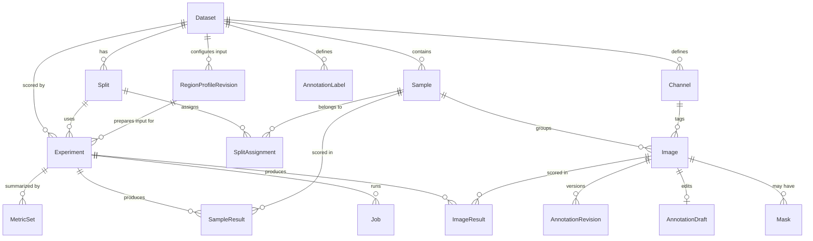

# Domain data model

Persistence is **one plain SQL schema script plus a thin repository layer — no ORM** (ADR-0004). The
script is `backend/src/anomaly_lab/db/migrations/001_initial.sql`, and `db/migrate.py` names it with one
constant, `SCHEMA_VERSION`, stamped into `PRAGMA user_version`. At startup an empty database gets the
script; a database at `SCHEMA_VERSION` is opened as it is; anything else — an older or newer stamp, or an
unstamped file that already holds tables — is refused with `SchemaVersionError`, whose message names the
database file to delete. Nothing is ever migrated. Changing the script means bumping `SCHEMA_VERSION`, and a
value is never reused. Repositories are small modules of functions returning pydantic domain objects; they
contain the SQL and nothing else.
`foreign_keys` and WAL journaling are enabled on every connection.

The model is defined by ADR-0041. Three rules carry most of its weight:

> **The Sample owns its anomaly label and the split assignment.** An `Image` is a file; a `Sample` is a
> physical object. Verdicts and split membership attach to samples, which structurally prevents putting two
> views of one part in different subsets.

> **Truth is task-scoped.** A sample's `normal`/`defect` label is anomaly truth. A class — a region or a
> box of an `AnnotationLabel` — is class truth, and lives only in completed annotation revisions. A
> dataset whose truth is its classes leaves every sample `unlabeled`.

> **Channel is data, not schema.** Channels are rows in a per-dataset dictionary table, not columns and not
> an enum. A dataset with two channels, three, or none is representable without a schema change.

## Entities

### Dataset

`id`, `name`, `root_path`, `adapter`, `manifest_path`, `created_at`, `notes`, `collection`,
`annotation_scope`, `default_channel`.

A named collection of samples rooted at an absolute path outside this repository. `root_path` is a
reference, never a copy destination, and it is **unique**: re-importing a directory updates the dataset it
produced ([import](import.md)). One capture tree holding several products is therefore several datasets,
each with its own `dataset_root`. `name` and `root_path` are identity and not editable.

`annotation_scope ∈ {image, sample}` decides whether annotation truth is *edited* per photograph or per
part; it is stored per image either way (ADR-0036). Only `PUT /api/datasets/{id}/annotation-scope` writes
it, and it refuses while the dataset has imported source masks, samples whose images differ in size, or an
open draft ([annotations](annotations.md)).

`notes`, `collection` and `default_channel` are editable only through `PATCH /api/datasets/{id}`, and all
three are **overrides**: null means something derived answers instead.

- **`notes` and `collection`** — the API returns an *effective* `description` and `collection` that fall
  back to the reference pack the dataset was registered from. Pack membership is derived on every read
  (`registered_dataset_id`, from `(name, adapter, resolved root_path)`). A collection is **one level deep
  and free text**: a string on the dataset, not a table, so it exists exactly as long as some dataset names
  it — there is no empty collection to create or delete.
- **`default_channel`** — names, by channel **name**, the view a part is shown in wherever one photograph
  stands for it (a grid tile, a queue card, the sample viewer's first tab). Without it that is the sample's
  first image by `Channel.position`, which is scan order, not the illumination a part is judged under. A
  name survives a re-import that renumbers the dictionary. The API returns the **raw** value and the client
  resolves it per sample, falling back to the first image when a part lacks that channel. **Validated on
  write, forgiving on read**: `PATCH` refuses a name the dataset has no channel for and lists the ones it
  has. The catalogue cover (`cover_image_id`) prefers the default channel, then follows the dataset's
  truth: a normal sample for a dataset with labels, and for a dataset of classes alone an image whose
  completed annotation shows the class most samples show (the first such class in class order).

**What truth a dataset holds is derived on every read, never stored** (ADR-0041), and the API reports it
on `DatasetSummary`:

- `truth` lists `labels` when some sample's label is `normal` or `defect`, and `classes` when some image's
  newest completed revision pins a class with pixels in its class table. Both, or neither, are ordinary.
- `class_counts` lists each class that some sample shows — `key`, `name`, `color`, and `samples`, the
  samples any of whose images' newest revision shows it — in class order. An imported ground-truth mask is
  anomaly truth and is not counted here.

### Channel

`id`, `dataset_id`, `name`, `position`. The per-dataset acquisition-channel dictionary, created **at import**
from canonicalized folder names (`BrightField` / `Brightfield` / `Bright` → `bright`). `position` fixes
display order. Channel *count* is never assumed: a dataset may have one, two, three, or a mixture across
samples. Unique on `(dataset_id, name)`.

### Sample

`id`, `dataset_id`, `group_key`, `external_id`, `label`, `label_source`, `notes`. One physical part.
`group_key` identifies the source group (e.g. a batch folder) and `external_id` the part within it; the
pair is unique per dataset, because numeric ids collide across groups. `label ∈ {normal, defect,
unlabeled}` is the part's **anomaly** verdict, and `unlabeled` means there is none; it is never null, and it
says nothing about classes (ADR-0041). An adapter sets a verdict only where its source asserts one;
`label_source` is `import` (inferred from folder structure) or `manual` (edited in the UI).

### Image

`id`, `sample_id`, `channel_id` (nullable), `path`, `width`, `height`, `bit_depth`, `file_size`, `sha256`,
`imported_at`. One file on disk, unique on `(sample_id, path)` — the key that makes re-import idempotent.
`channel_id` is nullable so single-view datasets need no synthetic channel, and `RESTRICT`, so a channel
cannot be dropped from under its images; dataset deletion therefore deletes children first inside one
transaction rather than relying on cascades, which SQLite does not order. The `sha256` captured at import
makes files immutable identities, which is what allows caching by `image_id` ([media](media.md)) and lets
`verify` detect drift.

### Mask

`id`, `image_id`, `path`, `kind`, `sha256` (nullable). Source pixel-level ground truth, referenced in place
like its image (ADR-0015). Identity is `(image_id, kind)`, so a re-import repoints a mask rather than adding
one; a mask the manifest no longer mentions is left alone, as a missing image is reported rather than
deleted. `sha256` pins source-mask provenance (ADR-0032) and stays `NULL` until the file first becomes an
annotation base — nothing claims to have verified bytes it did not read. `verify` reports existence
separately from digest coverage.

### Annotation truth

- **`AnnotationLabel`** — `id`, `dataset_id`, `key`, `name`, `color`, `position`, `created_at`. The
  dataset's class taxonomy — defect kinds on an anomaly dataset, object classes on a class dataset;
  `key` is the stable identity stored in shapes, so presentation fields change without rewriting
  documents. Every dataset has the default class `defect`, the one class anomaly truth also answers
  for: an imported ground-truth mask is its region, and a sample labelled `normal` is its absence
  (ADR-0041).
- **`AnnotationDraft`** — `image_id`, `base_revision_id`, `document` (JSON), `version`, source-mask
  provenance, `updated_at`. At most one mutable source-frame document per image; `version` is the
  optimistic-concurrency token exposed as an ETag.
- **`AnnotationRevision`** — `id`, `image_id`, `revision_no`, `document` (JSON), document and mask SHA-256,
  `mask_path`, source-mask provenance, `class_mask_path`, `class_mask_sha256`, `class_table` (JSON),
  `instances_path`, `instances_sha256`, `completed_at`. Completion materialises an app-owned binary PNG,
  a class-index PNG and an instances JSON and appends this row; a trigger makes rows immutable, and they
  are deleted only with their dataset. Completion always writes the class and instance columns; the
  schema leaves them nullable, and a resolver reading a revision without them falls back to its
  document.

A document's shape list holds `PolygonShape`, `BoxShape` and `BitmapShape`, all with stable ids, taxonomy
keys, an optional `instance_id` and ordered `add` / `subtract` composition. A bitmap is a cropped binary PNG positioned in source pixels — the
lossless form for imported masks, LabelMe masks and COCO RLE. See [annotations](annotations.md).

### Split

`id`, `dataset_id`, `name`, `strategy`, `seed`, `params`, `created_at`. A named partition of a dataset's
samples, **immutable once created**. `strategy`, `seed` and `params` record how it was produced so it can
be regenerated exactly — a seed alone reproduces nothing without its fractions.

- **`normal_only_train`** — seeded, stratified by capture group, normals only in training.
- **`imported`** — adopts the partition the source dataset published, read from the committed manifest and
  recorded in `params.manifest_id`, so a number computed here is comparable to the published one. Samples
  the manifest does not place are left *out* of the split, not swept into `test`: adding samples the
  benchmark never scored would change every metric's denominator.
- **`manual`** and **`few_shot`** — a few-shot task's references in `train` and every other sample in
  `test`, with no `val` (ADR-0040). `manual` takes `params.sample_ids`; `few_shot` draws `params.shots`
  samples that show `params.label_key`, under the seed, so three seeds are three reference draws.
- **`class_stratified`** — a supervised task's split, segmentation's and detection's alike (ADR-0039),
  because detection truth labels an image by the same presence rule: the samples whose every image answers
  for every class of the dataset (recorded in `params.classes`) are drawn under the seed into `train`
  (`params.train_fraction`) and `test`, stratified by the set of classes each shows; every other
  sample goes to `params.unlabeled_subset` (`test` by default; never `train`). No `val`. A class two or
  more samples show always trains, and is tested unless every sample showing it is the only training
  sample of another class; a class one sample shows goes where its stratum's draw puts it
  (`datasets/splitting.draw_class_stratified`).

### SplitAssignment

`(split_id, sample_id, subset)`, `subset ∈ {train, val, test}`, primary key `(split_id, sample_id)`.
**Sample-level by construction** — there is no image-level assignment table, so all channels of a part share
a subset.

### RegionProfileRevision

`id`, `dataset_id`, `name`, `revision_no`, `extractor_type`, `extractor_config` (JSON), `prepared_width`,
`prepared_height`, `padding_fraction`, `resample`, `created_at`, `sample_alignment`. One immutable
dataset-owned configuration for localising and preparing input (ADR-0033); the database rejects updates, so
changing any value appends a revision. An extractor failure may reduce build coverage but never silently
substitutes the full frame. A completed build lives under
`data/region-profiles/profile-<id>/` as one lossless PNG per source image, a deterministic JSON-lines
transform manifest and a bounded summary whose digests make configuration and materialisation auditable.
Transforms (`regions/transform.py`) name points in pixel-centre coordinates and crops in half-open
pixel-edge coordinates, matching numpy and Pillow, so a contained resize projects back without half-pixel
drift.

`sample_alignment` decides whether the images of one sample are cropped independently. `per_image` (the
default) keeps each image's own extractor box. `union` runs the extractor per image, then gives every image
of the sample one transform whose crop is the union of their padded, clipped crops, so the channels of a
part stay registered for per-position fusion; a single-image sample is unchanged. A union needs one frame:
a sample whose images differ in source size fails every one of them by name, and a sample with a failed
image fails its siblings too, with a reason naming the failure, rather than cropping the rest on their
own. It is accepted only for an extractor whose transform is an axis-aligned box in the source frame
(`RegionExtractor.crops_to_box`, true of every shipped extractor); anything else is refused at creation
with a 422. The field enters the configuration digest only at a non-default value, so every revision
authored before it keeps the digest its build recorded.

### Experiment

`id`, `name`, `dataset_id`, `split_id`, `region_profile_id`, `region_manifest_sha256`, `model_type`, `task`,
`target_label`, `classes` (JSON), `model_config` (JSON), `preprocessing_config` (JSON), `eval_config` (JSON), `channels` (JSON), `status`,
`artifact_dir`, `created_at`, `notes`.

**Configuration is frozen at creation.** There is no separate `Run` entity: different settings make a *new*
experiment, so every result row is attributable to one immutable configuration.

- `task ∈ {anomaly, few_shot_segmentation, semantic_segmentation, object_detection}` (ADR-0039). Creation
  refuses a method whose `Capabilities.tasks` does not list the task, and a task with no registered
  evaluator.
- `target_label` is the annotation class a targeted task segments, and is null for `anomaly`
  (ADR-0040). Creation refuses a class the dataset does not have, a `few_shot` split drawn for another
  class, and a reference in `train` that does not show the class.
- `classes` is the JSON list of annotation class keys a `semantic_segmentation` or `object_detection` run
  learns, pinned at creation as every class of the dataset in taxonomy order (ADR-0039).
  `classes[i]` is label index `i + 1` in the run's targets, label maps and confusion matrices; 0 is
  background. `[]` for every other task. At most 254, because label maps are 8-bit and 255 means "no pinned class answers".
- `channels` is a JSON array of channel **names** this run reads; `[]` means every channel. Names, because a
  frozen record must stay readable in a job log (`["bright"]` says what `[17]` does not), and
  `ImageRecord.channel` at the plugin boundary is a name too. An unknown name is refused at creation (422),
  and the selection is stored in `Channel.position` order, not the order the client sent.
- `status ∈ {draft, training, trained, failed}`.
- The pinned region profile must belong to the dataset and its manifest must be a complete immutable build.
  `preprocessing_config` stores the resolved prepared dimensions plus colour policy, not a second resize.
- `artifact_dir` is `data/artifacts/exp-<id>/`. Startup removes only exact app-owned `exp-<id>`
  directories whose row no longer exists, never traversing a dataset source path.

### Job

`id`, `kind`, `experiment_id` (nullable), `status ∈ {queued, running, succeeded, failed, cancelled}`,
`progress` (0–1), `message`, `log_path`, `params` (JSON), `result` (JSON), `started_at`, `finished_at`,
`error`. The async execution record ([jobs](jobs.md)). `kind` is a `JobKind`: `import`,
`reference_import`, `verify`, `prewarm`, `train`, `infer`, `distill`, `model_asset_download`,
`region_prepare`, `export`; only experiment-bound kinds have an `experiment_id`. `params` is the per-kind
input and `result` what the job produced (from its `done` event), kept apart so a finished job never has to
guess which is which. On startup any job still `running` is a leftover from a crash and becomes `failed`
with an explanatory error.

**An extensible vocabulary is validated in Python; a shape is checked by the schema.** `job.kind`,
`experiment.task` and `sample_result.aggregation` are plain text columns whose enums are enforced in
Python, because SQLite cannot alter a CHECK and a growing list would cost a table rebuild each time. What
describes shape stays a CHECK: a job's `status` lifecycle, `progress` in [0, 1], a label or subset, the
three-valued `localized` flags.

### ImageResult

`(experiment_id, image_id)`, `score`, `map_path` (nullable), `inference_ms`, `peak_x` / `peak_y` /
`localized` (nullable). Per-image method output. `map_path` references a stored map under the
experiment's `maps/` — `.npz`, or a source-frame `.npy` in an older run ([methods](methods.md#anomaly-maps)) —
`NULL` when the method produces no map. `peak_x` / `peak_y` are the map's argmax in
source-frame pixels — a property of the map alone, unaffected by later annotation edits. `localized` is the
threshold-free verdict on (map, ground truth): `1` the peak is inside the annotated region within tolerance,
`0` outside, `NULL` **not applicable** (a normal image, a defect with no resolved mask, an unreadable map).
`NULL` is never a miss ([evaluation](evaluation.md)).

### SampleResult

`(experiment_id, sample_id)`, `agg_score`, `aggregation`, `normalization` (nullable), `localized`
(nullable). The sample-level score derived from the sample's `ImageResult` rows. `aggregation` records the
reduce (`max` / `mean`) and `normalization` how per-channel scores were put on one scale first (`none` /
`robust_z` / `rank`; `NULL` means `none`), so a stored result stays self-describing when a default changes.
`localized` is resolved from the image that *produced* the aggregate score.

These rows are **derived, not recorded**: `evaluate_and_store` rebuilds them from stored `ImageResult`
scores before computing metrics, which is what lets `POST /api/experiments/{id}/reevaluate` apply a changed
`eval_config` without re-running the method.

### MetricSet

`(experiment_id, subset)`, `metrics` (JSON), `ground_truth_digest` (nullable), `computed_at`.
**Threshold-independent metrics only** — ROC-AUC (sample- and image-level), average precision, counts,
timing summaries. The digest identifies the exact labels and resolved masks measured and is compared with
current metadata to mark a metric set stale. Nothing threshold-dependent is persisted
([evaluation](evaluation.md)).

---

[← the handbook](README.md) · [why it is shaped this way](../adr/README.md)
