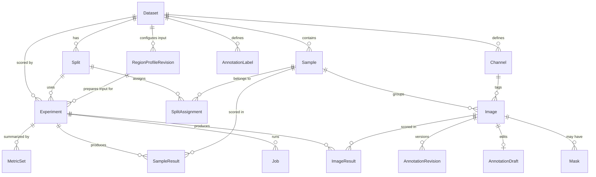

# Domain data model

Persistence is **plain SQL migrations plus a thin repository layer — no ORM** (ADR-0004). Migrations are
numbered files `backend/src/anomaly_lab/db/migrations/NNN_description.sql`, applied in order at startup,
tracked by SQLite's `PRAGMA user_version`. Repositories are small modules of functions returning pydantic
domain objects; they contain the SQL and nothing else. Rationale: the schema is small and stable, the queries
are simple, and an explicit schema file is the most readable documentation of the data model. `foreign_keys`
and WAL journaling are enabled on every connection.

The domain model is defined by ADR-0005. Two rules carry most of its weight:

> **The Sample owns the label and the split assignment.** An `Image` is a file; a `Sample` is a physical
> object. Labels describe objects, so they attach to samples. Split membership likewise, which structurally
> prevents the leakage of putting two views of the same part in different subsets.

> **Channel is data, not schema.** Channels are rows in a per-dataset dictionary table, not columns and not
> an enum. A dataset with two channels, three channels, or none is representable without a migration.

## Entities

**`Dataset`** — `id`, `name`, `root_path`, `adapter`, `manifest_path`, `created_at`, `notes`,
`collection`, `annotation_scope`.
A named collection of samples rooted at an absolute path on disk, outside this repository.
`root_path` is a reference, never a copy destination, and it is **unique**: re-importing a directory
updates the dataset it already produced rather than creating a second one beside it (handbook import.md).
Because it is unique, one capture tree holding several products is several datasets, and the scan's
`dataset_root` is how each records an identity distinct from the directory that was walked — see
[import](import.md). `adapter` and `manifest_path` record how the dataset came to look the way it does.

`annotation_scope ∈ {image, sample}` decides whether annotation truth is *edited* per photograph or per
part; it is stored per image either way (ADR-0036). It is written only by
`PUT /api/datasets/{id}/annotation-scope`, which refuses the move while the dataset has imported source
masks, has samples whose images differ in size, or has any draft open — see
[annotations](annotations.md).

`notes`, `collection` and `default_channel` are the three editable columns, written only by
`PATCH /api/datasets/{id}`. All three are **overrides, not records** — each is null until somebody
says otherwise, and null means something derived answers instead. For the first two the API does the
deriving: it returns an *effective* `description` and `collection` that fall back to the reference
pack a dataset was registered from when the column is null or blank. Membership in a pack stays
derived — `registered_dataset_id` recomputes it from `(name, adapter, resolved root_path)` on every
read — so a dataset registered long before either
column existed still groups and describes itself, and nothing needed a backfill. Grouping is **one
level deep and free text**: a collection has no attributes of its own, so it is a string on the dataset
rather than a table, and there is no nesting below it. It follows that **a collection exists for
exactly as long as some dataset names it** — there is no empty collection to create and none to
delete, so the UI names one and fills it in a single step, and clearing the last member is what
dissolves it.

`default_channel` is the same kind of override with a different fallback. It names, by channel
**name**, the view this dataset is read in wherever one photograph has to stand for a whole part — a
grid tile, a queue card, the tab the sample viewer opens on. Until it existed that was always the
sample's first image, and "first" means the lowest `Channel.position`, which is the order the channel
folders happened to be scanned in at import: a fact about the source tree rather than about which
illumination the part is judged under. A name rather than a channel id for the reason
`Experiment.channels` gives — `upsert_channel` matches on `(dataset_id, name)`, so a name survives a
re-import that renumbers the dictionary.

Its fallback is the one thing the server cannot compute, because "the sample's first image" is a
per-sample answer and the dataset row does not know which channels any given part was photographed
in. So unlike `description` and `collection` the API returns the **raw** value and the client resolves
it, falling back to the first image both when a part lacks that channel — the reference data's
two-channel capture group — and when a later import renamed the channel away. **Validated on write,
forgiving on read**: `PATCH` refuses a name the dataset has no channel for and says which names it
does have, so a stored preference is never quietly wrong, and a screen never goes blank over one.
The catalogue cover is the exception that is server-side: `cover_image_id` prefers the default
channel before it prefers a normal sample, so a card shows the dataset the way the dataset is read.

`name` and `root_path` are deliberately not editable; they are identity.

**`Channel`** — `id`, `dataset_id`, `name`, `position`.
The per-dataset acquisition-channel dictionary, created **at import time** from canonicalized source folder
names (e.g. `BrightField` / `Brightfield` / `Bright` → `bright`). `position` fixes a stable display order.
Channel *count* is never assumed anywhere in the code: a dataset may have one channel, two, three, or a
mixture across samples. Unique on `(dataset_id, name)`.

**`Sample`** — `id`, `dataset_id`, `group_key`, `external_id`, `label`, `label_source`, `notes`.
The logical unit: one physical part. `group_key` identifies the source group (e.g. an acquisition batch
folder), and `external_id` is the identifier within that group — the pair is unique per dataset, because
numeric sample IDs collide across groups in the reference data. `label ∈ {normal, defect, unlabeled}`;
`label_source` records provenance (`import` when inferred from folder structure, `manual` when edited in the
UI) so that hand corrections are distinguishable from imported guesses.

**`Image`** — `id`, `sample_id`, `channel_id` (nullable), `path`, `width`, `height`, `bit_depth`,
`file_size`, `sha256`, `imported_at`.
One file on disk, unique on `(sample_id, path)` — the key that makes a re-import idempotent (handbook import.md).
`channel_id` is nullable so that single-view datasets need no synthetic channel. It is also `RESTRICT`,
so a channel cannot be dropped out from under the images using it; the cost is that deleting a dataset
cannot rely on cascades, since SQLite does not order them, and the repository deletes children first
inside one transaction instead.
Dimensions, bit depth and `sha256` are captured at import: the hash makes imported files effectively immutable
identities, which is what allows caching by `image_id` ([the media layer](media.md)) and lets `verify` detect drift or deletion.

**`Mask`** — `id`, `image_id`, `path`, `kind`, `sha256` (nullable).
Pixel-level ground truth, referenced in place like the image it annotates. The table existed unused from the
first migration until public datasets that ship masks were adopted (ADR-0015); defining it early is what let
them be imported with no schema change (handbook import.md). Identity is `(image_id, kind)`, so a re-import repoints a
mask rather than accumulating a second one; a mask the manifest no longer mentions is left alone, for the same
reason a missing image is reported rather than deleted.

Migration 005 added the nullable digest needed to pin source-mask provenance (ADR-0032). Existing rows remain
`NULL` until the file first becomes an annotation base; nothing pretends to have verified bytes it did not
read. `verify` still reports existence separately from digest coverage.

**`AnnotationLabel`** — `id`, `dataset_id`, `key`, `name`, `color`, `position`, `created_at`.
The dataset's defect taxonomy. `key` is the stable identity stored in shapes; presentation fields can change
without rewriting completed documents.

**`AnnotationDraft`** — `image_id`, `base_revision_id`, `document` (JSON), `version`, source-mask provenance,
`updated_at`. At most one mutable source-frame document per image. Its version is the optimistic-concurrency
token exposed as an ETag.

**`AnnotationRevision`** — `id`, `image_id`, `revision_no`, `document` (JSON), document and mask SHA256,
`mask_path`, source-mask provenance, `completed_at`. Completion materialises an app-owned binary PNG and
appends this row. A database trigger makes rows immutable; deletion remains available only as part of the
dataset lifecycle. See [annotation truth](annotations.md).

An annotation document's discriminated shape list currently contains `PolygonShape` and `BitmapShape`.
Both use stable ids, taxonomy keys and ordered `add` / `subtract` composition. Bitmap data is a cropped binary
PNG positioned in source pixels; this is the lossless bridge for imported masks, LabelMe mask shapes, COCO
RLE and the editor's future brush strokes.

**`Split`** — `id`, `dataset_id`, `name`, `strategy`, `seed`, `params`, `created_at`.
A named partition of a dataset's samples. `strategy`, `seed` and `params` record how it was produced so it
can be regenerated exactly — a seed alone reproduces nothing without the fractions it was drawn under. Splits are immutable once created; changing a split means creating a new one.

Two strategies exist. **`normal_only_train`** draws one: seeded, stratified by capture group, normals only in
training. **`imported`** adopts the partition the source dataset published, read from the manifest the dataset
was committed from and recorded in `params.manifest_id` — no seed, no fractions, no stratification, because
the point is to reproduce someone else's split exactly so that a number computed here is comparable to the one
they published (handbook import.md). Samples the manifest does not place are left *out* of the split rather than swept
into `test`: a benchmark's protocol decides what belongs in its test set, and adding samples it never scored
would change the denominator of every metric.

**`SplitAssignment`** — `(split_id, sample_id, subset)`, `subset ∈ {train, val, test}`.
Primary key `(split_id, sample_id)`. **Sample-level by construction** — there is no image-level assignment
table, so all channels of a part necessarily share a subset and cross-channel leakage is impossible.

**`RegionProfileRevision`** — `id`, `dataset_id`, `name`, `revision_no`, `extractor_type`,
`extractor_config` (JSON), `prepared_width`, `prepared_height`, `padding_fraction`, `resample`,
`failure_policy`, `seed`, `created_at`. One immutable dataset-owned configuration for localising and preparing image input
(ADR-0033). The database rejects updates; changing any value appends a revision. `failure_policy` is
currently only `fail`: an extractor failure may reduce build coverage but cannot quietly substitute the
full source frame. Preview/build state and per-image transforms are operational records rather than mutable
fields on this configuration row. A completed build lives under app-managed profile storage as one lossless
PNG per successful source image, a deterministic JSON-lines transform manifest and a bounded summary whose
digests make both configuration and materialisation auditable.

**`Experiment`** — `id`, `name`, `dataset_id`, `split_id`, `region_profile_id`,
`region_manifest_sha256`, `model_type`, `model_config` (JSON),
`preprocessing_config` (JSON), `eval_config` (JSON), `channels` (JSON), `status`, `artifact_dir`,
`created_at`, `notes`.

`channels` is a JSON array of channel **names** naming the acquisition channels this run reads; `[]` means
every channel, which is what every experiment created before migration 013 meant, so the column needed no
backfill. Names rather than ids: `upsert_channel` matches on `(dataset_id, name)` so ids do survive a
re-import, and the argument is legibility instead — a frozen scientific record has to stay readable in a job
log and an audit script, where `["bright"]` says what `[17]` does not. Every other frozen column already
stores meaning the same way (`model_type` is a registry key), and `ImageRecord.channel` — the plugin boundary
itself — is already a name. An unknown name is refused at creation rather than producing a run that silently
read nothing.
`status ∈ {draft, training, trained, failed}`. **Configuration is frozen at creation.** There is no separate
`Run` entity: re-running with different settings creates a *new* experiment. This makes every result row
unambiguously attributable to one immutable configuration, which is the whole point of a comparison workbench.
The pinned region profile must belong to the dataset and its manifest must be a complete immutable build.
`preprocessing_config` stores the resolved prepared dimensions plus colour policy, not a second resize.
`artifact_dir` points at `data/artifacts/exp-<id>/`. Startup removes only exact app-owned `exp-<id>`
directories whose database row no longer exists; this also reclaims payloads deliberately orphaned by a
breaking schema migration without ever traversing a dataset source path.

**`Job`** — `id`, `kind ∈ {import, reference_import, verify, prewarm, train, infer, distill,
model_asset_download, region_prepare}`, `experiment_id` (nullable — only
train and infer jobs have one),
`status ∈ {queued, running, succeeded, failed, cancelled}`, `progress` (0–1), `message`, `log_path`,
`params` (JSON), `started_at`, `finished_at`, `error`.
The async execution record ([the job system](jobs.md)). On backend startup, any job still marked `running` is a leftover from a crash
or a hard kill and is transitioned to `failed` with an explanatory error — the process that owned it is
provably gone, so the UI never shows a phantom running job.
`params` carries the per-kind payload — `experiment_id` identifies what a train or infer job acts on, but
an import job has no experiment and still needs its root path, adapter and options recorded — and `result`
carries what the job produced, from its `done` event. Input and output are kept apart so that re-reading a
finished job never has to guess which is which.

**`ImageResult`** — `(experiment_id, image_id)`, `score`, `map_path` (nullable), `inference_ms`.
Per-image model output. `map_path` references a float32 `.npy` under the experiment's `maps/` directory;
`NULL` when the model does not produce anomaly maps. `inference_ms` feeds per-sample timing statistics.

**`SampleResult`** — `(experiment_id, sample_id)`, `agg_score`, `aggregation`, `normalization` (nullable).
The sample-level score derived by the evaluation layer from that sample's `ImageResult` rows. `aggregation`
records the reduce used (`max` / `mean`) and `normalization` records how the per-channel scores were put on
one scale before it (`none` / `robust_z` / `rank`), so a stored result stays self-describing after either
default changes. `normalization` is `NULL` on rows written before migration 014, which meant `none`.

These rows are **derived, not recorded**: `evaluate_and_store` rebuilds them from the stored `ImageResult`
scores before computing metrics, which is what makes `POST /api/experiments/{id}/reevaluate` genuinely able to
apply a changed `eval_config` without re-running the model. It previously refreshed the metric sets while
leaving these rows at whatever the original run reduced, so the promise in its own docstring held only as long
as nobody tested it.

**`MetricSet`** — `(experiment_id, subset)`, `metrics` (JSON), `ground_truth_digest` (nullable for legacy
rows), `computed_at`.
**Threshold-independent metrics only** — ROC-AUC (sample-level and image-level), average precision, sample
counts, timing summaries. The digest identifies the exact labels and resolved revision/source masks measured;
it is compared with current metadata to mark an older metric set stale. Nothing that depends on a decision
threshold is persisted here ([the evaluation layer](evaluation.md)).

---

[← the handbook](README.md) · [why it is shaped this way](../adr/README.md)
