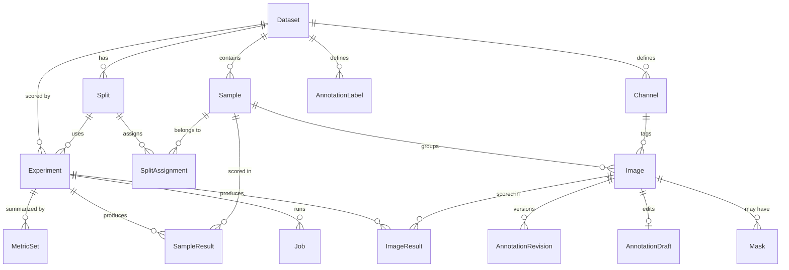

# Domain data model

Persistence is **plain SQL migrations plus a thin repository layer — no ORM** (ADR-0004). Migrations are
numbered files `backend/src/anomaly_lab/db/migrations/NNN_description.sql`, applied in order at startup,
tracked by SQLite's `PRAGMA user_version`. Repositories are small modules of functions returning pydantic
domain objects; they contain the SQL and nothing else. Rationale: the schema is small and stable, the queries
are simple, and an explicit schema file is the most readable documentation of the data model. `foreign_keys`
and WAL journaling are enabled on every connection.

The domain model is defined by ADR-0005. Two rules carry most of its weight:

> **The Sample owns the label and the split assignment.** An `Image` is a file; a `Sample` is a physical
> object. Labels describe objects, so they attach to samples. Split membership likewise, which structurally
> prevents the leakage of putting two views of the same part in different subsets.

> **Channel is data, not schema.** Channels are rows in a per-dataset dictionary table, not columns and not
> an enum. A dataset with two channels, three channels, or none is representable without a migration.

## Entities

**`Dataset`** — `id`, `name`, `root_path`, `adapter`, `manifest_path`, `created_at`, `notes`.
A named collection of samples rooted at an absolute path on disk, outside this repository.
`root_path` is a reference, never a copy destination, and it is **unique**: re-importing a directory
updates the dataset it already produced rather than creating a second one beside it (ADR-0013).
`adapter` and `manifest_path` record how the dataset came to look the way it does.

**`Channel`** — `id`, `dataset_id`, `name`, `position`.
The per-dataset acquisition-channel dictionary, created **at import time** from canonicalized source folder
names (e.g. `BrightField` / `Brightfield` / `Bright` → `bright`). `position` fixes a stable display order.
Channel *count* is never assumed anywhere in the code: a dataset may have one channel, two, three, or a
mixture across samples. Unique on `(dataset_id, name)`.

**`Sample`** — `id`, `dataset_id`, `group_key`, `external_id`, `label`, `label_source`, `notes`.
The logical unit: one physical part. `group_key` identifies the source group (e.g. an acquisition batch
folder), and `external_id` is the identifier within that group — the pair is unique per dataset, because
numeric sample IDs collide across groups in the reference data. `label ∈ {normal, defect, unlabeled}`;
`label_source` records provenance (`import` when inferred from folder structure, `manual` when edited in the
UI) so that hand corrections are distinguishable from imported guesses.

**`Image`** — `id`, `sample_id`, `channel_id` (nullable), `path`, `width`, `height`, `bit_depth`,
`file_size`, `sha256`, `imported_at`.
One file on disk, unique on `(sample_id, path)` — the key that makes a re-import idempotent (ADR-0013).
`channel_id` is nullable so that single-view datasets need no synthetic channel. It is also `RESTRICT`,
so a channel cannot be dropped out from under the images using it; the cost is that deleting a dataset
cannot rely on cascades, since SQLite does not order them, and the repository deletes children first
inside one transaction instead.
Dimensions, bit depth and `sha256` are captured at import: the hash makes imported files effectively immutable
identities, which is what allows caching by `image_id` ([the media layer](media.md)) and lets `verify` detect drift or deletion.

**`Mask`** — `id`, `image_id`, `path`, `kind`, `sha256` (nullable).
Pixel-level ground truth, referenced in place like the image it annotates. The table existed unused from the
first migration until public datasets that ship masks were adopted (ADR-0015); defining it early is what let
them be imported with no schema change (ADR-0016). Identity is `(image_id, kind)`, so a re-import repoints a
mask rather than accumulating a second one; a mask the manifest no longer mentions is left alone, for the same
reason a missing image is reported rather than deleted.

Migration 005 added the nullable digest needed to pin source-mask provenance (ADR-0032). Existing rows remain
`NULL` until the file first becomes an annotation base; nothing pretends to have verified bytes it did not
read. `verify` still reports existence separately from digest coverage.

**`AnnotationLabel`** — `id`, `dataset_id`, `key`, `name`, `color`, `position`, `created_at`.
The dataset's defect taxonomy. `key` is the stable identity stored in shapes; presentation fields can change
without rewriting completed documents.

**`AnnotationDraft`** — `image_id`, `base_revision_id`, `document` (JSON), `version`, source-mask provenance,
`updated_at`. At most one mutable source-frame document per image. Its version is the optimistic-concurrency
token exposed as an ETag.

**`AnnotationRevision`** — `id`, `image_id`, `revision_no`, `document` (JSON), document and mask SHA256,
`mask_path`, source-mask provenance, `completed_at`. Completion materialises an app-owned binary PNG and
appends this row. A database trigger makes rows immutable; deletion remains available only as part of the
dataset lifecycle. See [annotation truth](annotations.md).

**`Split`** — `id`, `dataset_id`, `name`, `strategy`, `seed`, `params`, `created_at`.
A named partition of a dataset's samples. `strategy`, `seed` and `params` record how it was produced so it
can be regenerated exactly — a seed alone reproduces nothing without the fractions it was drawn under. Splits are immutable once created; changing a split means creating a new one.

Two strategies exist. **`normal_only_train`** draws one: seeded, stratified by capture group, normals only in
training. **`imported`** adopts the partition the source dataset published, read from the manifest the dataset
was committed from and recorded in `params.manifest_id` — no seed, no fractions, no stratification, because
the point is to reproduce someone else's split exactly so that a number computed here is comparable to the one
they published (ADR-0016). Samples the manifest does not place are left *out* of the split rather than swept
into `test`: a benchmark's protocol decides what belongs in its test set, and adding samples it never scored
would change the denominator of every metric.

**`SplitAssignment`** — `(split_id, sample_id, subset)`, `subset ∈ {train, val, test}`.
Primary key `(split_id, sample_id)`. **Sample-level by construction** — there is no image-level assignment
table, so all channels of a part necessarily share a subset and cross-channel leakage is impossible.

**`Experiment`** — `id`, `name`, `dataset_id`, `split_id`, `model_type`, `model_config` (JSON),
`preprocessing_config` (JSON), `eval_config` (JSON), `status`, `artifact_dir`, `created_at`, `notes`.
`status ∈ {draft, training, trained, failed}`. **Configuration is frozen at creation.** There is no separate
`Run` entity: re-running with different settings creates a *new* experiment. This makes every result row
unambiguously attributable to one immutable configuration, which is the whole point of a comparison workbench.
`artifact_dir` points at `data/artifacts/exp-<id>/`.

**`Job`** — `id`, `kind ∈ {import, verify, prewarm, train, infer}`, `experiment_id` (nullable — only
train and infer jobs have one),
`status ∈ {queued, running, succeeded, failed, cancelled}`, `progress` (0–1), `message`, `log_path`,
`params` (JSON), `started_at`, `finished_at`, `error`.
The async execution record ([the job system](jobs.md)). On backend startup, any job still marked `running` is a leftover from a crash
or a hard kill and is transitioned to `failed` with an explanatory error — the process that owned it is
provably gone, so the UI never shows a phantom running job.
`params` carries the per-kind payload — `experiment_id` identifies what a train or infer job acts on, but
an import job has no experiment and still needs its root path, adapter and options recorded — and `result`
carries what the job produced, from its `done` event. Input and output are kept apart so that re-reading a
finished job never has to guess which is which.

**`ImageResult`** — `(experiment_id, image_id)`, `score`, `map_path` (nullable), `inference_ms`.
Per-image model output. `map_path` references a float32 `.npy` under the experiment's `maps/` directory;
`NULL` when the model does not produce anomaly maps. `inference_ms` feeds per-sample timing statistics.

**`SampleResult`** — `(experiment_id, sample_id)`, `agg_score`, `aggregation`.
The sample-level score derived by the evaluation layer from that sample's `ImageResult` rows. `aggregation`
records the method used (`max` / `mean`) so a stored result is self-describing.

**`MetricSet`** — `(experiment_id, subset)`, `metrics` (JSON), `computed_at`.
**Threshold-independent metrics only** — ROC-AUC (sample-level and image-level), average precision, sample
counts, timing summaries. Nothing that depends on a decision threshold is persisted here ([the evaluation layer](evaluation.md)).

---

[← the handbook](README.md) · [why it is shaped this way](../adr/README.md)
