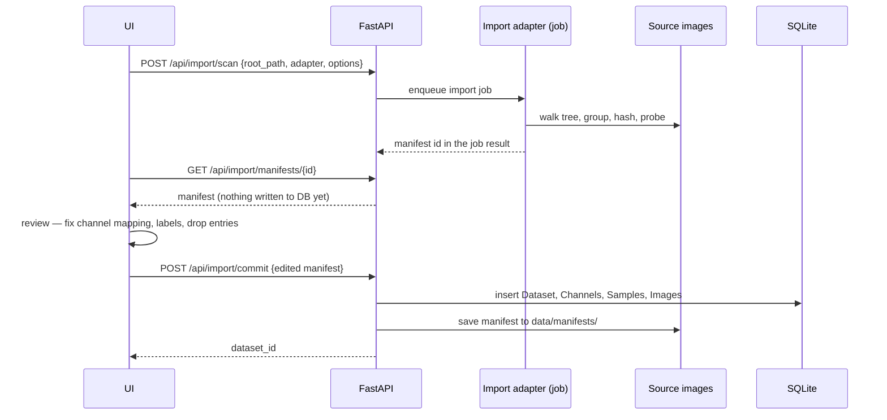

# Dataset import

Import is **two-stage: adapter → reviewable manifest → commit** (ADR-0006). Directory layouts in the wild are
irregular, and an importer that guesses silently produces a corrupt catalog discovered much later.

## Scan — `POST /api/import/scan`

Runs a **pluggable adapter** against a root path as an `import` job. `GET /api/import/adapters` lists the
adapters with their option schemas.

### `channel_folders`

The grouped multi-channel layout:

- **Label detection** from folder names, tolerating `defect`, `Defect`, `no-defect`, `no_defect`, `normal`,
  `ok`; anything unmatched is `unlabeled`, never a guess.
- **Channel canonicalization** by fuzzy matching — `Bright` / `BrightField` / `Brightfield` → `bright`,
  `Dark` / `DarkField` → `dark`, `Dome` / `DomeIllumination` → `dome`. The proposed mapping is **part of the
  manifest and editable in the UI**, so unfamiliar channel names import without a code change.
- **Grouping by filename stem** within a group folder: the same stem across channel folders is one part.
  Group + stem form `(group_key, external_id)`. The **group key keeps the label component**, since the same
  stem can exist under both a defect and a no-defect folder.

**Matching is by component, not by position.** Each path component is tested against the label vocabulary,
then the channel vocabulary, and the remainder becomes the group key, so label folders may sit above or
below channel folders. Prefix matching applies to **tokens**, not whole components: normalization strips
separators, so a directory named `"<Channel> <Group>"` begins with the channel name, and matching it whole
would silently merge that group into its parent.

### `folder_classes`

Name the directories holding defect-free images (`normal_dirs`) and defective ones (`defect_dirs`), as globs
relative to the root, each covering its subtree. Optional `mask_dir` / `mask_pattern` templates locate ground
truth, including in a sibling directory. The matched directory's name is recorded on the sample, so a
per-defect-type breakdown needs no defect-type schema. A file in a directory no option names imports
unlabelled **and is reported**. One image per sample, `channel_id = NULL`.

Two options cut a few-shot panel out of a many-class tree. `import_unnamed_dirs = false` imports only the
named directories, filtered before anything is probed, and counts the rest as excluded. `masks_for_normal_dirs
= false` leaves a normal directory's masks behind: they are still recognised as masks rather than imported as
images, but they are not attached, so the image is a confirmed absence of the class rather than a positive
([annotations](annotations.md)).

### `csv_table`

Reads a table the dataset ships. Every column name is an option, as are the values meaning normal, defective
and each subset. `filter_column` / `filter_value` turn one table covering a benchmark family into one dataset
per class — the one-class protocol those benchmarks are scored under. With `channel_column`, rows sharing a
sample identity become one multi-channel sample. `csv_table` carries the source's **published partition**
into the manifest, which `SplitStrategy.IMPORTED` materializes ([domain model](domain-model.md)); an official
one-class protocol usually has **no `val` subset**, and an empty validation set is ordinary.

### Manifest and warnings

The manifest holds proposed samples `{group_key, label, images: [{path, channel}]}`, the channel mapping and a
non-fatal `warnings` list:

- a sample whose channel count differs from its siblings is a **warning, not an error** — variable channel
  counts are legitimate data;
- images that matched no channel in a dataset that *has* channels are **surfaced for review** with the
  unrecognized directory names, so the operator adds a mapping rather than discovering a mis-import later;
- unreadable files, zero-byte files and duplicate hashes are reported with their paths.

## Probe

`datasets/probe.py` runs after the adapter and answers what only the pixels can; it is adapter-agnostic, and
no adapter knows it exists.

- **Colour-plane separability** — the median R² of one plane regressed on another, *not* a byte-identity
  boolean, which answers "no" for any monochrome sensor with per-plane noise or white-balance gain. At or
  above `0.99` the manifest says so, and the grayscale input option is near-free.
- **Channel registration** — phase correlation of each channel against the sample's first, in source pixels
  (phase rather than plain cross-correlation, because illuminations differ in brightness by design). The
  result carries a **peak-to-sidelobe ratio** as well as an offset: a diffuse peak means "not a
  translation", not "aligned".
- **Mode and size agreement** — mixed `L` and `RGB` is normalized by `load_array` but not by anything reading
  files directly. Channels of different sizes are counted and skipped, never resized.

Every pass is capped with `evenly_spaced`, and every message states how many of how many were read.

## Several datasets from one tree

`dataset.root_path` is unique and is what a commit resolves against, so scanning one tree twice cannot make
two datasets. The scan's optional **`dataset_root`** is the path recorded as the dataset's identity, while
`root_path` stays where the walk starts; it must be the scan root or inside it. Paired with the adapter's
`exclude`, one channel-first tree becomes one dataset per variant. The reference packs use the same
mechanism: each VisA class gets the root `visa/<class>` while scanning from `visa/`.

## Commit — `POST /api/import/commit`

Takes the (possibly edited) manifest, creates or updates `Dataset`, `Channel`, `Sample` and `Image` rows in
one transaction, and **saves the committed manifest to `data/manifests/`**. It is **synchronous**: walking
and hashing happened during the scan. It is idempotent, never downgrades a hand-made label, and reports
rather than deletes a recorded file the manifest no longer mentions. The stored manifest is the
reproducibility record — which files became which samples under which channel mapping.

## Invariants

- **Images are never copied.** Only absolute paths are stored (ADR-0022); the source tree stays read-only.
- **`sha256` is recorded** for every image at scan time.
- **`POST /api/import/verify`** re-checks existence and hashes as a job, reporting missing, modified or
  unreadable files. It detects drift and never repairs it.

## Reference packs

**The workbench is proved on public benchmarks, and they are downloaded, never committed.** They are large
and freely obtainable, so vendoring them would add gigabytes and buy nothing. `/datasets/` is gitignored for
size, not secrecy; the README says how to obtain each pack and credits it under its authors' licence, and
`scripts/check-repo-safety.sh` fails if anything under it is staged. The cost is that a clone gets
instructions rather than a runnable benchmark. A method is also checked against the paper's own number on
the paper's own split, not only against its own regression baselines: a gap is acceptable where
preprocessing or resolution explains it, an unexplained one is a bug no self-consistent test suite can
find ([measurements](../measurements.md)).

`GET /api/reference-packs` discovers public packs under the configured reference-data root (the gitignored
`/datasets/` in development) from metadata alone — it knows the published layouts of VisA, GKN, FSS-1000 and
PKU-Market-PCB and
opens no image to decide whether a pack exists. Absent and incomplete packs are instructional states showing the
expected root and upstream link.

`POST /api/reference-packs/register` creates one cancellable `reference_import` job for the selected packs.
VisA becomes twelve `csv_table` datasets, one per class; GKN becomes one `folder_classes` dataset. Both are
anomaly datasets, and their labels come from the source's own normal/defect split. All scans finish before
the database changes, then every missing manifest commits in one transaction, so a failed class cannot
leave half a benchmark registered. Repeating the action skips datasets already present.

FSS-1000 becomes **one** `folder_classes` dataset, `FSS-1000 panel`: the 200 images of a fixed panel of
twenty classes (`FSS_PANEL`, [measurements](../measurements.md)), scanned from `fewshot_data/` with the
twenty class directories named as `unlabeled_dirs`. No sample gets a label — an FSS-1000 image shows an
object, and is neither normal nor defective (ADR-0041). Each image's mask is its **class truth**, entered
after the commit (below) as a region of the class its directory names. A few-shot run then names its class
and draws its references from this one dataset; the other nineteen classes' images are its confirmed
absences by their own annotations (ADR-0040). Only `.jpg` files import, because a few classes carry a
stray `.jpeg` beside the image its mask pairs with, and the `.png` masks are truth rather than samples.

### Class truth a pack ships

Some packs are annotated with classes rather than with verdicts, and an imported mask cannot carry that: it
answers for the default class alone. A pack declares such truth with `DatasetSpec.class_truth`, and after
the commit `register_class_truth` enters it as each image's first completed revision. It sets no sample
label. Two shapes are supported:

- **`BoxTruthSpec`** — a Pascal VOC file per image. PKU-Market-PCB becomes one `folder_classes` dataset of
  693 unlabelled boards, its six `images/<kind>/` directories named as `unlabeled_dirs` and `rotation/` and
  `PCB_USED/` left out; its files under `Annotations/<kind>/` hold boxes of six classes.
- **`MaskTruthSpec`** — a binary mask per image, of the class its directory names (`classes` maps each
  directory to a class). FSS-1000's `<class>/<n>.png` beside `<class>/<n>.jpg`. A directory name becomes a
  class key by `class_key` — lower case, `[a-z0-9_-]`, a letter first, so `abe's_flyingfish` is
  `abes_flyingfish` — and a name by `class_name` (`Abe's flyingfish`).

Both follow the same steps:

- every file is found and checked first, and one that names a class outside the taxonomy, has a size other
  than its image's, or holds a box wholly outside the frame fails the job before anything is written. A box
  partly outside is clipped and counted (`datasets/voc.py`);
- the classes are added to the taxonomy after the ones the dataset has, in the editor's palette, because a
  revision answers only for classes that existed when it was completed;
- each image's truth becomes one document on an empty base — one `box` shape per object, or one `bitmap`
  shape of its class cropped to the mask — completed through the ordinary draft lifecycle
  (`annotations/imported_truth.py`) as the image's first revision. It answers every class, present where it
  has a region and absent where it has none, so a class task reads it like a drawn revision
  ([class truth](annotations.md#detection-truth)). An empty mask asserts every class absent.

A mask is foreground wherever it is non-zero, the rule every imported mask is read by; FSS-1000's are
anti-aliased, so its soft edge is foreground here. VOC corners are 1-based and inclusive, so
`xmin = 1, xmax = 3` is the pixel-edge box `[0, 3)`. Boxes are drawn largest first, so where two overlap the
smaller keeps its pixels; one whose whole edge an overlap covers has a tighter instance box than was drawn,
and the job counts it. An image that already has a revision or an open draft keeps it and is counted as
kept, and an image with no file stays unlabelled. This step runs after the commit and image by image, so a
cancelled or failed job can leave a registered dataset partly labelled. The catalogue therefore counts a
dataset as `pending` while any image with a file has neither a revision nor a draft
(`class_truth_unfinished`), and registering the pack again finishes it.

A pack supplies a **collection name** (`PackSpec.collection`, falling back to its title) and a **one-line
description** per dataset (`DatasetSpec.description`). Neither is written at registration: `pack_membership`
resolves both on read by inverting the discovery matcher (`registered_dataset_id`). A user's own `collection`
or `notes` overrides them; clearing it restores them.

## Options form

An adapter's options are a pydantic model whose **JSON Schema drives the import form**: control type follows
the schema node, descriptions become help text, and defaults become placeholders, never pre-filled values —
an untouched control sends nothing and the Python default stays the only definition. A field whose default
is *empty* is shown; one with a working default is folded behind a disclosure. A new option therefore needs
no frontend work.

---

[← the handbook](README.md) · [why it is shaped this way](../adr/README.md)
