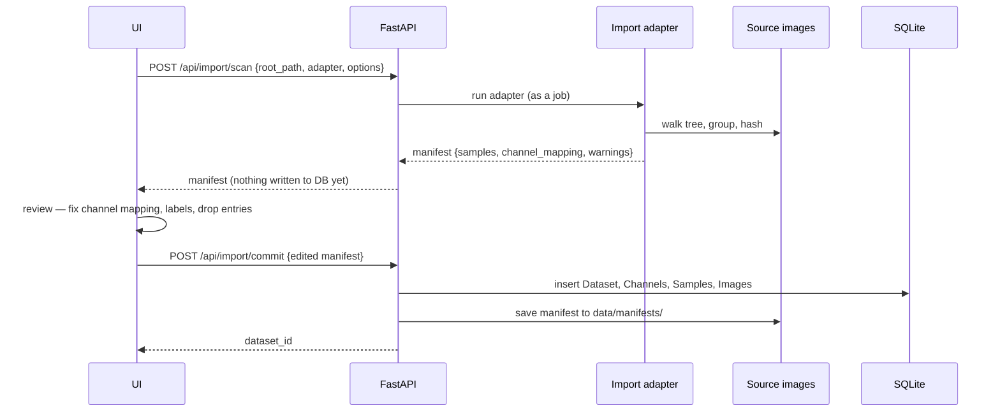

# Dataset import

Import is **two-stage: adapter → reviewable manifest → commit** (ADR-0006). Directory layouts in the wild are
irregular, and a one-shot importer that guesses silently produces a corrupt catalog that is discovered only
much later.

## Stage 1 — `POST /api/import/scan`

Runs a **pluggable adapter** against a root path. The first adapter, `channel_folders`, encodes the reference
layout:

- **Label detection** from folder names, tolerating the variants that occur in practice (`defect`, `Defect`,
  `no-defect`, `no_defect`, `normal`, `ok`); anything unmatched yields `unlabeled` rather than a guess.
- **Channel canonicalization** by fuzzy matching folder names to canonical keys — `Bright` / `BrightField` /
  `Brightfield` → `bright`, `Dark` / `DarkField` / `Darkfield` → `dark`, `Dome` / `DomeIllumination` →
  `dome`. The proposed mapping is **part of the manifest and editable in the UI**: the fuzzy matcher is a
  convenience, not an authority, and a new dataset with unfamiliar channel names must be importable without a
  code change.
- **Grouping by filename stem** within a group folder: the same stem across channel folders is the same
  physical part. Group + stem form `(group_key, external_id)`, which is what makes numeric IDs that repeat
  across groups safe. The **group key keeps the label component** — the same stem exists under both a
  defect and a no-defect folder, so dropping it would collide two different parts onto one identity.

**Matching is by component, not by position.** The adapter does not know whether label folders sit above
channel folders or below them: each path component is tested against the label vocabulary, then the channel
vocabulary, and whatever is left becomes the group key. Prefix matching applies to **tokens** rather than
whole components, because normalization strips separators — a directory named `"<Channel> <Group>"`
normalizes to a string that *begins with* the channel name, and matching it whole would swallow the group
name and silently merge that group into its parent. That case is not hypothetical; it is how one real
capture group is laid out.

The adapter emits a **manifest JSON**: proposed samples `{group_key, label, images: [{path, channel}]}`, the
channel mapping, and a `warnings` list. Warnings are deliberately non-fatal:

- a sample with a channel count different from its siblings (e.g. the two-channel group) is a **warning,
  not an error** — variable channel counts are legitimate data, and the importer must never enforce a fixed
  count;
- images that matched no channel in a dataset that *has* channels are **surfaced for review**, together
  with the directory names that were not recognized, so the operator can add a mapping rather than
  discover a mis-import later. (The reference tree's machine-generated timestamped filenames were assumed
  not to group; measurement shows they group perfectly. The path exists for datasets that
  genuinely do not.)
- unreadable files, zero-byte files and duplicate hashes are reported with their paths.

## What the scan measures

The adapter answers "what is this file" from its name and its place in the tree. Two further questions are
decided by the pixels, neither is discoverable by looking at the directory layout, and both change what a user
should do next. `datasets/probe.py` answers them after the adapter has finished, so it is adapter-agnostic by
construction and no adapter knows it exists.

- **How separable are the colour planes?** Reported as the median R² of one plane regressed on another, *not*
  as a boolean. The obvious test — are the planes byte-identical — answers "no" for any monochrome sensor with
  per-plane read noise or a white-balance gain, while the useful answer is "one plane predicts the others to
  within a fraction of a grey level". A boolean here would be actively misleading rather than merely coarse.
  Above `0.99` the manifest says so, and the grayscale model-input option becomes near-free.
- **Are a sample's channels registered?** Phase correlation of each channel against the sample's first, in
  source pixels. Phase correlation rather than plain cross-correlation because the illuminations differ in
  brightness by design. The result carries a **peak-to-sidelobe ratio** as well as an offset: a diffuse peak
  means "these frames do not differ by a translation", which is not the same as "they are aligned", and the
  difference matters when the answer is about to justify reading one annotation across several channels.
- **Do the files share a mode and size?** A dataset mixing `L` and `RGB` is normalized by `load_array`, but
  not by anything that reads the files directly. Channels of different sizes are counted and skipped rather
  than resized, because resizing to compare would invent an answer for a sample that cannot have one.

Every pass is capped with `evenly_spaced` and every message states how many of how many were read. A probe
that silently looked at the first 32 files of an acquisition-ordered corpus would describe one production
batch and call it the dataset.

## One tree, several datasets

`dataset.root_path` is unique and is what a commit resolves against, which is what makes a re-import
idempotent. A capture tree that holds more than one product therefore cannot become more
than one dataset by scanning it twice — both scans would record the same root and collide into one,
mixing two different parts into a single normal-only training population.

The scan request's optional **`dataset_root`** is the separation: it is the path recorded as the
dataset's identity, while `root_path` stays where the walk starts. It must be the scan root or a
directory inside it, so an identity always names somewhere the images actually came from. Paired with
the adapter's `exclude`, one channel-first tree becomes one dataset per variant: scan the whole tree,
exclude everything but one variant, record that variant's directory as the root. This is not a new
mechanism — the reference packs already do exactly this internally, giving each of VisA's twelve object
classes the root `visa/<class>` while scanning from `visa/` — only a previously private one made
public.

## Stage 2 — `POST /api/import/commit`

Takes the (possibly edited) manifest, creates or updates `Dataset`, `Channel`, `Sample` and `Image` rows in
one transaction, and **saves the committed manifest to `data/manifests/`**. It is **synchronous, not a
job**: the walk and the hash already happened during the scan, so this is a few hundred inserts and
measures in milliseconds. It is also idempotent, never downgrades a hand-made label, and reports rather
than deletes a recorded file the manifest no longer mentions. The stored manifest is the
reproducibility record: it states exactly which files became which samples under which channel mapping, and
re-importing the same tree can be diffed against it.

## Invariants

- **Images are never copied.** Only absolute paths are stored (ADR-0022). The source tree stays read-only.
- **`sha256` is recorded** for every image at scan time.
- **`POST /api/import/verify`** re-checks existence and hashes as a job, reporting missing, modified or
  unreadable files. It detects drift and never repairs it. This is what keeps a reference-in-place catalog
  trustworthy over months.

## Proving the abstraction

Two further adapters ship, and between them they cover the public benchmarks. Both produce **one
image per sample with `channel_id = NULL`**, which is what finally demonstrated that the domain model handles
single-view datasets and that nothing downstream assumes grouping — a claim the design made from the start and
nothing exercised until then.

- **`folder_classes`** — the simple contract: name the directories holding defect-free images
  (`normal_dirs`) and defective ones (`defect_dirs`), as globs relative to the root, each covering the subtree
  beneath it. Optional `mask_dir` / `mask_pattern` templates locate ground truth, including in a sibling
  directory. The matched directory's name is recorded on the sample, so a per-defect-type breakdown needs no
  schema that enumerates defect types. Nothing is guessed: a file in a directory no option names imports
  unlabelled **and is reported**.
- **`csv_table`** — reads a table the dataset ships. Every column name is an option, as are the values meaning
  normal, defective, and each subset. `filter_column` / `filter_value` turn one table covering a benchmark
  family into one dataset per class, which is the one-class protocol those benchmarks are scored under. Set
  `channel_column` and rows sharing a sample identity become one multi-channel sample — the same adapter,
  no special case, because channel count is data.

`csv_table` also carries the source's **published partition** through into the manifest, which is what
`SplitStrategy.IMPORTED` materializes ([the evaluation layer](evaluation.md)). Note that an official one-class protocol generally has train and
test and **no `val` subset at all**, so an empty validation set is ordinary rather than a broken split.

## Local reference packs

`GET /api/reference-packs` performs a metadata-only discovery pass under the configured public
reference-data root (the repository's gitignored `/datasets/` directory in development). It knows the
published layouts of VisA and GKN but does not open an image merely to decide whether a pack exists.
Absent and incomplete packs remain instructional states, with their expected root and upstream source
link visible in the dataset catalogue.

`POST /api/reference-packs/register` creates one cancellable `reference_import` job for every selected
pack. VisA becomes twelve ordinary `csv_table` datasets, one per object class; GKN becomes one
`folder_classes` dataset. Scans finish before the database changes, then all missing manifests commit in
one transaction. A failed class therefore cannot leave half a benchmark registered. Repeating the action
skips datasets already present. Source images and masks are referenced in place and remain read-only.

A pack also supplies the two things the catalogue needs to present its datasets: a **collection name**
(`PackSpec.collection`, falling back to its title — GKN sets a short one so a pack of one dataset does
not head a group with the same words as the single card inside it) and a **one-line description** per
dataset (`DatasetSpec.description`). Neither is written at registration. Both are resolved on read by
`pack_membership`, which inverts the same `registered_dataset_id` matcher the discovery pass uses, so
the twelve VisA classes group under `VisA` whether they were registered today or before the column
existed. A user's own `collection` or `notes` overrides them; clearing it restores them.

## The options form

An adapter's options model is a pydantic model, and its **JSON Schema drives the import form**: control type
follows the schema node's type, descriptions become help text, and defaults become placeholders rather than
pre-filled values — so an untouched control sends nothing and the backend's default stays the only definition
of it. A field whose default is *empty* is shown; a field that already has a working answer is folded behind a
disclosure, which is what keeps "where are the good images" from being the tenth question on the screen.

This was specified from the beginning and **built late**: until then the import screen hardcoded a single
option and relied on Python defaults for the rest, which was survivable only while one adapter existed whose
defaults fitted the one dataset on hand. `csv_table` has a required option, and nothing in the UI could supply
it. The gap is recorded above.

---

[← the handbook](README.md) · [why it is shaped this way](../adr/README.md)
