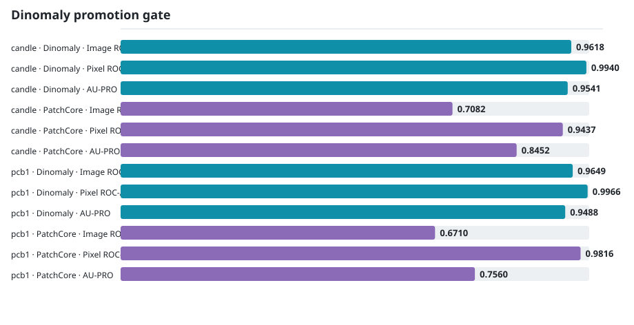
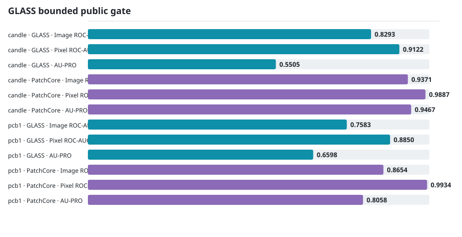
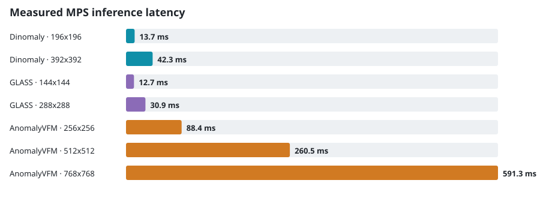

<!-- Generated by scripts/build-book.py; do not edit. -->
# Public benchmarks

These are checked measurements from the repository's public-data gates, not upstream leaderboard numbers. Compare rows **within one protocol block only**: prepared sizes and PatchCore settings differ between gates. Each block links to the full protocol, assets, versions, decision rule, and limitations.

## Dinomaly promotion gate

**Protocol:** VisA official one-class split; 392 × 392 RGB identity; seed `20260812`. Same prepared pixels within each class. Dinomaly: 5,000 steps. PatchCore: WRN-50, 256 images, 50,000 candidates, 10% coreset. [Full evidence](../../measurements.md).

| Class | Method | Image ROC-AUC | Pixel ROC-AUC | AU-PRO | Train | Infer | Peak RSS |
|---|---|---:|---:|---:|---:|---:|---:|
| candle | Dinomaly | 0.9618 | 0.9940 | 0.9541 | 611.7 s | 13.7 s | 1.13 GiB |
| candle | PatchCore | 0.7082 | 0.9437 | 0.8452 | 16.3 s | 13.6 s | 1.61 GiB |
| pcb1 | Dinomaly | 0.9649 | 0.9966 | 0.9488 | 596.0 s | 15.6 s | 1.15 GiB |
| pcb1 | PatchCore | 0.6710 | 0.9816 | 0.7560 | 16.8 s | 15.9 s | 1.61 GiB |

## GLASS bounded public gate

**Protocol:** VisA official one-class split; 288 × 288 RGB identity; seed `20260812`. Same prepared pixels within each class. GLASS: 5,000 updates, batch 1. PatchCore is the paired reference for this gate. [Full evidence](../../measurements.md).

| Class | Method | Image ROC-AUC | Pixel ROC-AUC | AU-PRO | Train | Infer | Peak RSS |
|---|---|---:|---:|---:|---:|---:|---:|
| candle | GLASS | 0.8293 | 0.9122 | 0.5505 | 1146.0 s | 15.5 s | 1.34 GiB |
| candle | PatchCore | 0.9371 | 0.9887 | 0.9467 | 16.3 s | 10.0 s | 1.62 GiB |
| pcb1 | GLASS | 0.7583 | 0.8850 | 0.6598 | 1203.0 s | 14.8 s | 1.07 GiB |
| pcb1 | PatchCore | 0.8654 | 0.9934 | 0.8058 | 16.7 s | 12.9 s | 1.62 GiB |

## Resource measurements

Prepared size changes the workload, so these bars describe Mac feasibility and scaling—not a speed race between methods. Values are batch-one warm inference from the linked smoke gates.

| Method | Device | Prepared | Inference | Peak RSS | MPS driver | Evidence |
|---|---|---:|---:|---:|---:|---|
| Dinomaly | MPS | 196² | 13.7 ms | 0.82 GiB | 0.52 GiB | [log](../../measurements.md) |
| Dinomaly | MPS | 392² | 42.3 ms | 0.82 GiB | 0.62 GiB | [log](../../measurements.md) |
| GLASS | MPS | 144² | 12.7 ms | 1.04 GiB | 1.20 GiB | [log](../../measurements.md) |
| GLASS | MPS | 288² | 30.9 ms | 1.05 GiB | 1.19 GiB | [log](../../measurements.md) |
| AnomalyVFM | MPS | 256² | 88.4 ms | 3.18 GiB | 2.08 GiB | [log](../../measurements.md) |
| AnomalyVFM | MPS | 512² | 260.5 ms | 3.18 GiB | 2.07 GiB | [log](../../measurements.md) |
| AnomalyVFM | MPS | 768² | 591.3 ms | 3.18 GiB | 2.07 GiB | [log](../../measurements.md) |

## What the evidence supports

- Dinomaly cleared its predeclared two-class quality floors and is the transformer reconstruction reference, at a substantially longer fit than PatchCore.
- GLASS remained experimental: it cleared pixel floors but missed the image ROC-AUC floor by 0.0062 under its bounded gate.
- AnomalyVFM passed the local resource gate but is not yet an integrated method; quality and offline asset handling remain unproven in this workbench.
- These two VisA classes are promotion gates, not a claim of universal performance. New data needs its own split, masks, baselines, and failure review.
