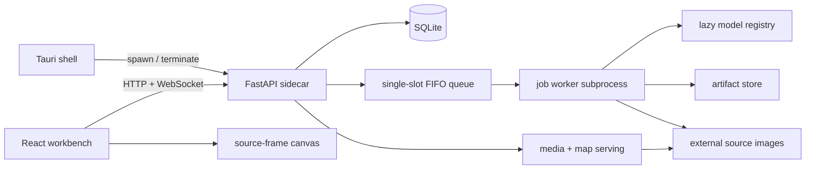

# System design

Visual Anomaly Lab is a local monorepo with a React/Tauri desktop client, a FastAPI sidecar, worker
subprocesses, SQLite metadata, and filesystem artifacts.

## Desktop boundary

Tauri is deliberately thin. It spawns the sidecar on an OS-selected loopback port, reads a structured ready
event, injects the URL before creating the window, provides native folder/Finder capabilities, and tears the
process group down on exit. The backend has no Tauri dependency, so the browser development path exercises
the same API.

## Backend and jobs

The API process owns routing, catalogue reads/writes, media delivery, comparison, and job coordination.
Import, region preparation, training, inference, and export run out of process. One FIFO slot avoids MPS
contention. JSON-line events unify progress, logs, metrics, cancellation, and WebSocket fan-out across job
kinds.

One resident inference worker supports low-latency on-demand diagnostics. A lock shared with the queue's
pre-spawn hook prevents it from coexisting with a training worker on the accelerator.

## Persistence

SQLite stores entities, configuration, relationships, scores, and paths. Large or array-shaped artifacts—
checkpoints, raw maps, diagnostics, manifests, thumbnails, and exports—live on disk. Source images remain
outside the worktree and are referenced read-only. Schema migrations are numbered; schema v1 is frozen.

## Extension boundaries

- Import layout: adapter + registration entry.
- Anomaly method: model module + lazy registry entry.
- Job kind: handler entry + handler function.
- Diagnostic view: declarative kind payload; UI renders by kind.
- Method/adapter configuration: Pydantic schema; UI generated from JSON Schema.
- Portable method: exporter protocol implemented by the plugin; generic job and Rust runner unchanged.

These are architectural tests. A feature leaking across them is evidence the boundary is incomplete.

## Evaluation boundary

Models receive pixels and no ground truth. Evaluation reads catalogue labels/masks, aggregates grouped
samples, computes metrics, and resolves thresholds. Raw score units never cross runs. Region preparation is
pinned by experiment and inverse projection restores source-frame maps before pixel measurement.

## Security and operating assumptions

The sidecar binds only to `127.0.0.1` and has no authentication. The system assumes one trusted local user,
trusted model code, and trusted source paths. It is not a sandbox for untrusted datasets or checkpoints.
Bundle verification protects integrity and path traversal during deployment; it does not make an arbitrary
ONNX graph safe to execute.

For full component and failure detail, read the canonical [architecture handbook](../architecture/README.md).
