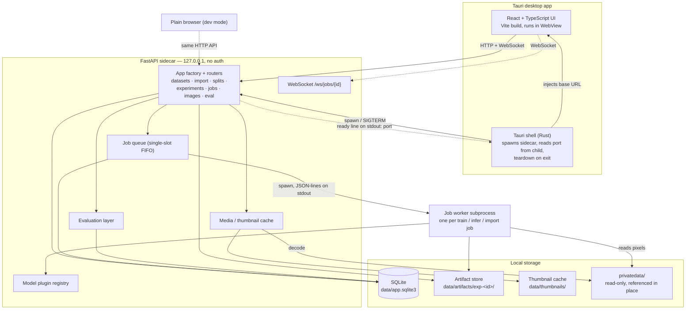
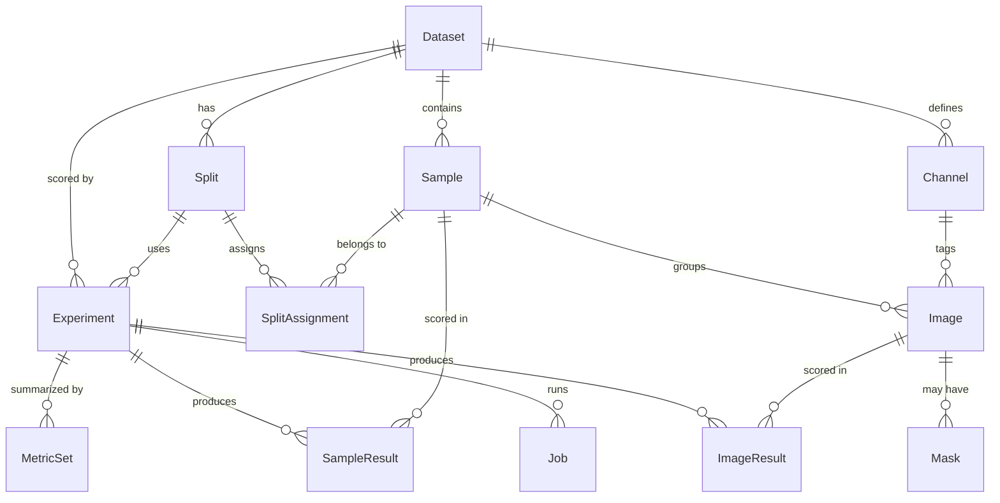
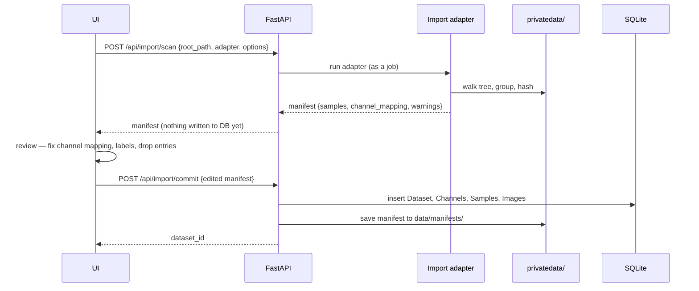

# System Design — visual-anomaly-lab

**Status:** design baseline, kept in step with the implementation. M0–M2 are built; M3 onward still
describes the target system. Decisions referenced as `(ADR-NNNN)` are recorded in [`docs/adr/`](adr/). Sequencing of the work
is in [`docs/roadmap.md`](roadmap.md); task-level breakdown is in [`docs/backlog.md`](backlog.md).

---

## 1. Overview & goals

`visual-anomaly-lab` is a **local desktop research workbench** for visual anomaly detection. The long-term
goal is a *universal* anomaly-detection explorer usable across many image datasets; the showcase dataset,
images of a manufactured circular part, is the first reference dataset — an initial focus, not the final
scope — and only the classical baseline exploits its geometry (design constraint 1 below). The workbench
exists so that several anomaly-detection approaches can be trained, evaluated and compared on the *same*
dataset under the *same* evaluation protocol, with results that are persisted, reopenable and reproducible.

The workbench supports one loop, end to end:

| Stage | What the user does |
| --- | --- |
| **Import** | Point the app at a folder of images; review a proposed manifest; commit it into the catalog. |
| **Label & split** | Mark logical samples normal / defect / unlabeled; create seeded train/val/test splits. |
| **Train** | Create an experiment: dataset + split + model + model config + preprocessing config; run it as an async job with live progress and logs. |
| **Infer** | Score a subset (or individual samples) with a trained experiment, producing per-image scores and anomaly maps. |
| **Evaluate** | Compute threshold-independent metrics; explore a threshold interactively; inspect FP/FN; view ranked most-normal / most-anomalous lists. |
| **Compare** | Put several experiments side by side under one protocol. |

### Non-goals

The brief's scope constraints are binding. The system deliberately does **not** implement:

- production-line integration or automatic accept/reject decisions,
- authentication, user accounts or multi-user access (ADR-0001, §11),
- cloud deployment or remote compute — everything runs on the local machine,
- distributed or multi-node training,
- real-time camera acquisition,
- complex annotation tooling — no polygon or brush mask editor. Masks are *imported* alongside the images
  that have them (§5) and never drawn here.

The guiding principle is **a small, understandable architecture over premature scalability**. There is one
user, one machine, one job at a time.

### Design constraints that shape everything below

1. **Dataset-agnostic core, dataset-specific baseline.** The classical baseline may exploit the part's
   circular geometry (ADR-0010); the domain model, import layer, DL methods and evaluation layer must not. In
   particular the number of acquisition channels is **never** hard-coded — it is per-dataset data (ADR-0005).
2. **Grouped samples are first-class.** A logical sample (one physical part) may carry several images. Labels
   and split membership live on the *sample*, never on the image, so all views of a part always share a subset.
3. **Private data never leaves the machine** (ADR-0001). Source images are referenced in place from
   `privatedata/`, read-only, never copied into tracked paths.
4. **Apple Silicon / MPS** is the target compute device; there is no GPU cluster and no CUDA assumption.

---

## 2. Component architecture



### Component responsibilities

**React + TypeScript UI (WebView).** All application screens (§12). It is a pure HTTP/WebSocket client — it
holds no privileged capability and calls no Tauri-only APIs for core functionality. Server state is fetched
from the sidecar; job progress arrives over WebSocket. The UI reads its backend base URL from a value injected
by the shell, falling back to a dev default (`http://127.0.0.1:8000`) so the same bundle runs in a browser.

**Tauri shell (Rust).** Thin desktop wrapper. Its entire job is process lifecycle (ADR-0003):

- **spawn the FastAPI sidecar** as a child process with the data directory in its environment and
  `ANOMALY_LAB_PORT=0`, then **read the port back from the child**. The sidecar binds the socket itself and
  announces `{"ev":"ready","port":N,"pid":N}` as one JSON line on stdout, in the ADR-0009 event envelope.
  The port is chosen by the OS and never released between choosing and serving, so there is no
  bind → close → re-bind race. (The shell allocating a port and passing it down would have one; ADR-0003
  specifies child-to-shell handoff for this reason.)
- **build the window only once the sidecar is ready**, injecting the base URL as `window.__ANOMALY_LAB__`
  before the page loads. The UI therefore never renders against a URL that does not exist yet and needs no
  retry-on-boot logic (ADR-0012);
- **tear down on exit** — `SIGTERM` to the child's process group, a grace period, then `SIGKILL`; the sidecar
  in turn terminates any running job worker. Closing the last window quits the application, since macOS
  would otherwise keep it alive with a sidecar serving a window that no longer exists.

Because stdout carries structured events, the sidecar's own logging goes to **stderr**, and the shell drains
**both** pipes for the life of the process — a child whose pipe fills up blocks on write.

macOS has no `PDEATHSIG` equivalent, so none of the above runs when the shell is force-quit or crashes. The
sidecar therefore **also watches its parent independently**: given `ANOMALY_LAB_PARENT_PID` it probes that pid
with signal 0 and exits when it disappears. It probes the recorded pid rather than comparing `os.getppid()`,
because `uv run` sits between the shell and the interpreter — the immediate parent is not the shell. This
watchdog, not the exit handler, is what guarantees no orphaned Python process survives an app crash.

The shell additionally provides native file/folder pickers for the import flow, since a browser cannot return
a server-visible absolute directory path.

**FastAPI sidecar.** The entire backend. Bound to `127.0.0.1` only, no authentication (§11). Routers:

| Router | Prefix | Responsibility |
| --- | --- | --- |
| `datasets` | `/api/datasets` | dataset CRUD, channel dictionary, sample listing/filtering, label edits |
| `import` | `/api/import` | `scan` (produce manifest) and `commit` (create rows); `verify` re-check |
| `splits` | `/api/splits` | create/list seeded splits, per-subset counts, assignments |
| `experiments` | `/api/experiments` | create (config frozen), list, detail, delete; model catalog + JSON Schema |
| `jobs` | `/api/jobs` | enqueue train/infer/import, status, cancel, log tail; `/ws/jobs/{id}` |
| `images` | `/api/images` | thumb / preview / full pixel delivery, anomaly-map PNG rendering |
| `eval` | `/api/eval` | threshold-independent metrics, on-demand threshold outputs, rankings, comparison |

**Model plugin registry.** A name → class dictionary of anomaly models (ADR-0007). Registry keys are stable
identifiers persisted in `Experiment.model_type`: `classical_circular`, `efficientad_anomalib`,
`patchcore_anomalib`, `efficientad_custom`. Adding a method means adding a module and a registry entry —
nothing else in the application changes.

**SQLite** at `data/app.sqlite3` — metadata, configuration, scores, paths (§4). **Artifact store** at
`data/artifacts/exp-<id>/` — checkpoints, reference statistics, anomaly maps, logs. **Thumbnail cache** at
`data/thumbnails/` (§9). **`privatedata/`** is treated as a read-only mount: the backend opens files there for
decoding and training and never writes to it.

### Standalone backend / browser-based development

The sidecar has **no dependency on Tauri** (ADR-0003). During development it runs directly:

```
uv run --directory backend uvicorn anomaly_lab.api.app:create_app --factory --reload --port 8000
```

and the React app runs under `vite dev` against it. Every feature is exercisable from a plain browser, which
keeps the Python and TypeScript work independently testable and makes the Rust layer optional until packaging.

CORS is permitted in dev mode only, and covers `http://localhost:*` and `http://127.0.0.1:*` **plus
`tauri://localhost` and `http://tauri.localhost`** — the Tauri v2 WebView origins. They are not localhost
*ports*, so a rule written only for the browser lets the browser path work while the desktop path fails.

Convenience scripts wrap the three ways to run the system: `scripts/dev-backend.sh` (backend alone, the
command above), `scripts/dev-frontend.sh` (Vite against it), and `scripts/dev-app.sh` (the full desktop app).

---

## 3. Repository structure

```
visual-anomaly-lab/
├── README.md                       # setup, dataset conventions, how to add a method
├── .gitignore                      # privatedata/, *.bmp, data/, venvs, build output
├── scripts/check-repo-safety.sh    # pre-push guard: fails if private data is staged (ADR-0001)
├── docs/
│   ├── system-design.md            # this document
│   ├── roadmap.md                  # milestones M0–M7
│   ├── backlog.md                  # epics E1–E12
│   └── adr/                        # 0001…0011 architecture decision records
│
├── backend/                        # Python, uv-managed
│   ├── pyproject.toml
│   ├── uv.lock
│   ├── src/anomaly_lab/
│   │   ├── api/                    # FastAPI app factory, routers, websockets, schemas
│   │   ├── domain/                 # pydantic entities, enums — no I/O
│   │   ├── db/                     # SQL migrations (NNN_*.sql), connection, repositories
│   │   ├── datasets/               # import adapters, manifest model, scan/verify
│   │   ├── media/                  # BMP decode, thumbnail/preview cache, map rendering
│   │   ├── models/                 # base.py (interface), classical/, anomalib_adapters/, registry
│   │   ├── jobs/                   # queue, subprocess worker entrypoint, event protocol
│   │   └── eval/                   # metrics, channel→sample aggregation, thresholds
│   └── tests/                      # pytest: unit + API-level with a temp data dir
│
├── frontend/                       # React + TypeScript + Vite
│   ├── package.json, bun.lock, vite.config.ts, tsconfig.json
│   ├── src/                        # api client, hooks, screens, components
│   └── src-tauri/                  # Rust desktop shell: sidecar spawn, port handoff, teardown
│       ├── Cargo.toml, tauri.conf.json
│       └── src/main.rs
│
├── privatedata/                    # GITIGNORED — source images, read-only, never copied
│   └── <dataset>/{set1,set2,unsorted}/…
│
└── data/                           # GITIGNORED — all app-managed state
    ├── app.sqlite3                 # metadata, scores, paths
    ├── manifests/                  # committed import manifests (reproducibility)
    ├── thumbnails/
    │   ├── thumb/                  # 256 px WebP
    │   └── preview/                # 1024 px WebP
    ├── artifacts/
    │   └── exp-<id>/
    │       ├── checkpoints/        # model weights / memory banks
    │       ├── references/         # classical baseline per-channel reference statistics
    │       ├── maps/               # float32 .npy anomaly maps
    │       └── logs/               # <job>.log — full worker stdout stream
    └── exports/                    # CSV / JSON exports of results and metrics
```

Monorepo layout (ADR-0002): one repository, two build systems, no shared build tooling — `uv` owns
`backend/`, `bun` + `cargo` own `frontend/`. The two halves are coupled only by the HTTP contract.

**Data directory resolution.** `data/` is repo-local by default so a fresh clone works with zero configuration
and everything stays inside the ignored tree. It is overridable via the `ANOMALY_LAB_DATA_DIR` environment
variable — needed for tests (temp dir per test), for packaged builds (OS app-data directory), and for putting
artifacts on an external disk. All backend code resolves paths through a single settings object; no module
constructs a path from `__file__` or the current working directory.

**Storage split.** SQLite stores *metadata, configuration, scores and paths only*. Pixel data — source images,
anomaly maps, thumbnails, checkpoints — always lives on the filesystem, referenced by path. This keeps the
database small enough to be trivially inspectable with `sqlite3`, keeps large binaries out of transactions,
and lets artifacts be deleted or archived by directory (ADR-0004).

---

## 4. Domain data model

Persistence is **plain SQL migrations plus a thin repository layer — no ORM** (ADR-0004). Migrations are
numbered files `backend/src/anomaly_lab/db/migrations/NNN_description.sql`, applied in order at startup,
tracked by SQLite's `PRAGMA user_version`. Repositories are small modules of functions returning pydantic
domain objects; they contain the SQL and nothing else. Rationale: the schema is small and stable, the queries
are simple, and an explicit schema file is the most readable documentation of the data model. `foreign_keys`
and WAL journaling are enabled on every connection.

The domain model is defined by ADR-0005. Two rules carry most of its weight:

> **The Sample owns the label and the split assignment.** An `Image` is a file; a `Sample` is a physical
> object. Labels describe objects, so they attach to samples. Split membership likewise, which structurally
> prevents the leakage of putting two views of the same part in different subsets.

> **Channel is data, not schema.** Channels are rows in a per-dataset dictionary table, not columns and not
> an enum. A dataset with two channels, three channels, or none is representable without a migration.



### Entities

**`Dataset`** — `id`, `name`, `root_path`, `adapter`, `manifest_path`, `created_at`, `notes`.
A named collection of samples rooted at an absolute path on disk (typically under `privatedata/`).
`root_path` is a reference, never a copy destination, and it is **unique**: re-importing a directory
updates the dataset it already produced rather than creating a second one beside it (ADR-0013).
`adapter` and `manifest_path` record how the dataset came to look the way it does.

**`Channel`** — `id`, `dataset_id`, `name`, `position`.
The per-dataset acquisition-channel dictionary, created **at import time** from canonicalized source folder
names (e.g. `BrightField` / `Brightfield` / `Bright` → `bright`). `position` fixes a stable display order.
Channel *count* is never assumed anywhere in the code: a dataset may have one channel, two, three, or a
mixture across samples. Unique on `(dataset_id, name)`.

**`Sample`** — `id`, `dataset_id`, `group_key`, `external_id`, `label`, `label_source`, `notes`.
The logical unit: one physical part. `group_key` identifies the source group (e.g. an acquisition batch
folder), and `external_id` is the identifier within that group — the pair is unique per dataset, because
numeric sample IDs collide across groups in the reference data. `label ∈ {normal, defect, unlabeled}`;
`label_source` records provenance (`import` when inferred from folder structure, `manual` when edited in the
UI) so that hand corrections are distinguishable from imported guesses.

**`Image`** — `id`, `sample_id`, `channel_id` (nullable), `path`, `width`, `height`, `bit_depth`,
`file_size`, `sha256`, `imported_at`.
One file on disk, unique on `(sample_id, path)` — the key that makes a re-import idempotent (ADR-0013).
`channel_id` is nullable so that single-view datasets need no synthetic channel. It is also `RESTRICT`,
so a channel cannot be dropped out from under the images using it; the cost is that deleting a dataset
cannot rely on cascades, since SQLite does not order them, and the repository deletes children first
inside one transaction instead.
Dimensions, bit depth and `sha256` are captured at import: the hash makes imported files effectively immutable
identities, which is what allows caching by `image_id` (§9) and lets `verify` detect drift or deletion.

**`Mask`** — `id`, `image_id`, `path`, `kind`.
Pixel-level ground truth, referenced in place like the image it annotates. The table existed unused from the
first migration until public datasets that ship masks were adopted (ADR-0015); defining it early is what let
them be imported with no schema change (ADR-0016). Identity is `(image_id, kind)`, so a re-import repoints a
mask rather than accumulating a second one; a mask the manifest no longer mentions is left alone, for the same
reason a missing image is reported rather than deleted.

There is deliberately **no `sha256` column**, and the consequence is stated rather than papered over: `verify`
can check that a mask file is still *there* and not that it is still the same file. Its report counts masks
apart from images so a clean result never implies a check that was not made. Lifting this is a migration, not
a patch (ADR-0004).

**`Split`** — `id`, `dataset_id`, `name`, `strategy`, `seed`, `params`, `created_at`.
A named partition of a dataset's samples. `strategy`, `seed` and `params` record how it was produced so it
can be regenerated exactly — a seed alone reproduces nothing without the fractions it was drawn under. Splits are immutable once created; changing a split means creating a new one.

Two strategies exist. **`normal_only_train`** draws one: seeded, stratified by capture group, normals only in
training. **`imported`** adopts the partition the source dataset published, read from the manifest the dataset
was committed from and recorded in `params.manifest_id` — no seed, no fractions, no stratification, because
the point is to reproduce someone else's split exactly so that a number computed here is comparable to the one
they published (ADR-0016). Samples the manifest does not place are left *out* of the split rather than swept
into `test`: a benchmark's protocol decides what belongs in its test set, and adding samples it never scored
would change the denominator of every metric.

**`SplitAssignment`** — `(split_id, sample_id, subset)`, `subset ∈ {train, val, test}`.
Primary key `(split_id, sample_id)`. **Sample-level by construction** — there is no image-level assignment
table, so all channels of a part necessarily share a subset and cross-channel leakage is impossible.

**`Experiment`** — `id`, `name`, `dataset_id`, `split_id`, `model_type`, `model_config` (JSON),
`preprocessing_config` (JSON), `eval_config` (JSON), `status`, `artifact_dir`, `created_at`, `notes`.
`status ∈ {draft, training, trained, failed}`. **Configuration is frozen at creation.** There is no separate
`Run` entity: re-running with different settings creates a *new* experiment. This makes every result row
unambiguously attributable to one immutable configuration, which is the whole point of a comparison workbench.
`artifact_dir` points at `data/artifacts/exp-<id>/`.

**`Job`** — `id`, `kind ∈ {import, verify, prewarm, train, infer}`, `experiment_id` (nullable — only
train and infer jobs have one),
`status ∈ {queued, running, succeeded, failed, cancelled}`, `progress` (0–1), `message`, `log_path`,
`params` (JSON), `started_at`, `finished_at`, `error`.
The async execution record (§6). On backend startup, any job still marked `running` is a leftover from a crash
or a hard kill and is transitioned to `failed` with an explanatory error — the process that owned it is
provably gone, so the UI never shows a phantom running job.
`params` carries the per-kind payload — `experiment_id` identifies what a train or infer job acts on, but
an import job has no experiment and still needs its root path, adapter and options recorded — and `result`
carries what the job produced, from its `done` event. Input and output are kept apart so that re-reading a
finished job never has to guess which is which.

**`ImageResult`** — `(experiment_id, image_id)`, `score`, `map_path` (nullable), `inference_ms`.
Per-image model output. `map_path` references a float32 `.npy` under the experiment's `maps/` directory;
`NULL` when the model does not produce anomaly maps. `inference_ms` feeds per-sample timing statistics.

**`SampleResult`** — `(experiment_id, sample_id)`, `agg_score`, `aggregation`.
The sample-level score derived by the evaluation layer from that sample's `ImageResult` rows. `aggregation`
records the method used (`max` / `mean`) so a stored result is self-describing.

**`MetricSet`** — `(experiment_id, subset)`, `metrics` (JSON), `computed_at`.
**Threshold-independent metrics only** — ROC-AUC (sample-level and image-level), average precision, sample
counts, timing summaries. Nothing that depends on a decision threshold is persisted here (§8).

---

## 5. Model plugin interface

Every anomaly-detection method is a plugin behind one interface (ADR-0007). The rest of the application knows
only this interface and the registry key.

```python
# backend/src/anomaly_lab/models/base.py

class Capabilities(BaseModel):
    requires_training: bool          # PatchCore/EfficientAD yes; a pure-reference method may say no
    produces_anomaly_map: bool       # drives whether the UI offers overlay controls
    channel_aware: bool              # model consumes channel metadata internally
    dataset_specific: bool           # True for classical_circular — surfaced as a UI warning
    preferred_device: Literal["cpu", "mps", "cuda"]


class ImageRecord(BaseModel):
    image_id: int
    sample_id: int
    channel: str | None              # canonical channel name, None for single-view datasets
    path: Path                       # absolute path into privatedata/, read-only


class Prediction(BaseModel):
    image_id: int
    score: float                     # higher = more anomalous
    anomaly_map: Path | None         # float32 .npy written into ctx.artifact_dir / "maps"
    inference_ms: float


class AnomalyModel(Protocol):
    @classmethod
    def config_model(cls) -> type[BaseModel]: ...
    @classmethod
    def capabilities(cls) -> Capabilities: ...

    def fit(self, train: Sequence[ImageRecord], ctx: TrainContext) -> None: ...
    def predict(self, images: Sequence[ImageRecord], ctx: InferContext) -> list[Prediction]: ...
    def save(self, artifact_dir: Path) -> None: ...
    def load(self, artifact_dir: Path) -> None: ...


MODEL_REGISTRY: dict[str, type[AnomalyModel]] = {
    "classical_circular":    ClassicalCircularModel,
    "efficientad_anomalib":  EfficientAdAnomalib,
    "patchcore_anomalib":    PatchCoreAnomalib,
    # "efficientad_custom":  EfficientAdCustom,   # second implementation, same interface (ADR-0008)
}
```

### Schema-driven configuration

`config_model()` returns a **pydantic model**, which the API exposes as JSON Schema at
`GET /api/experiments/model-types`. The frontend renders the experiment configuration form **directly from
that schema** — field types, defaults, ranges and descriptions all come from the Python side. Adding a
hyperparameter to a model therefore requires no frontend change at all, which is what makes "add a method
without touching the rest of the app" true in practice rather than aspirational.

### Contexts

`TrainContext` and `InferContext` carry the four things a long-running plugin needs and must not invent for
itself:

- **`artifact_dir`** — the experiment's directory; the only location a model may write to;
- **`progress(fraction, message)`** — progress callback, forwarded to the job event stream (§6);
- **`should_cancel()`** — cooperative cancellation check, polled at epoch/batch boundaries;
- **`log`** — structured logger whose records become `log` events in the job stream.

Models never touch SQLite, never read application settings, and never write outside `artifact_dir`.

### Contract: scores are per-image

> **Models emit per-image scores. Cross-channel aggregation belongs to the evaluation layer (§8).**

This is the seam that keeps evaluation model-independent. A model *may* use channel metadata internally —
`ImageRecord.channel` is provided, and the classical baseline relies on it to keep one reference statistic per
channel (ADR-0010) — but it still returns one `Prediction` per input image. No model decides how a part's
three views combine into a sample-level verdict; that policy lives in one place and is applied identically
to every method.

### Anomaly map storage

Anomaly maps are written as **float32 `.npy`** arrays — the source of truth, lossless, directly usable for
recomputing statistics or (later) pixel-level metrics against masks. The API renders **colormapped PNGs on
demand** at `GET /api/images/{image_id}/anomaly-map?experiment_id=…`, caching the rendered PNG. Overlay
opacity is applied in CSS by the UI, never baked into the served image, so the opacity slider is instant and
requires no server round-trip.

### Device policy

Defaults target Apple Silicon: `preferred_device = "mps"` for the DL adapters, `"cpu"` for the classical
baseline (ADR-0008). Device is resolved at job start with a graceful fallback to CPU when MPS is unavailable
or an operator is unimplemented, and the resolved device is recorded in the job log.

---

## 6. Async job system

Training and inference are long-running and must be asynchronous from the UI's perspective, with progress,
logs, completion and failure states. The execution model is **one subprocess per job** (ADR-0009).

### Why a subprocess

- **PyTorch + MPS are fork-unsafe.** Running training in a thread inside the API process, or forking it, risks
  deadlocks and driver-state corruption. A clean `spawn`ed process avoids the whole class of problem.
- **Crash and OOM isolation.** A segfault or an out-of-memory kill in a training run takes down the worker,
  not the API — the UI stays responsive and reports a failed job with its log.
- **Memory is reclaimed on exit.** Model weights, memory banks and MPS allocations disappear when the process
  ends; a long-lived server would otherwise accumulate them across experiments.
- **Cancellation is honest.** Cooperative cancellation is tried first via `should_cancel()`; if the worker does
  not stop, the parent escalates **`SIGTERM` → grace period → `SIGKILL`**. A thread offers no equivalent
  guarantee, and "cancel" that does not actually stop the work is worse than no cancel button.

### Queue

A **single-job FIFO queue** lives in the API process, mirrored into the `Job` table. One machine, one user, one
MPS device — concurrency would only cause contention and confusing timing measurements. Queued jobs are
visible and cancellable before they start. The queue is intentionally in-process: no Celery, no Redis, no
broker (ADR-0009).

### Worker → parent event protocol

The worker communicates with its parent over **JSON-lines on stdout** — one JSON object per line, flushed:

```json
{"ev":"progress","fraction":0.42,"message":"epoch 8/20"}
{"ev":"log","level":"info","message":"device=mps batch=8"}
{"ev":"metric","name":"train_loss","step":800,"value":0.0137}
{"ev":"done","result":{"images":189,"artifact_dir":"data/artifacts/exp-12"}}
{"ev":"error","type":"RuntimeError","message":"...","traceback":"..."}
```

Line-delimited JSON is chosen because it is trivial to produce, trivially parsed incrementally, human-readable
in a log file, and needs no shared-memory or socket setup between the two processes.

The parent does three things with each line:

1. **persists** `progress` / `message` / terminal state to the `Job` row (so a REST poll is always accurate);
2. **tees the full stream** to the job's `log_path` — including any non-JSON output such as third-party
   library chatter or a native crash message, which is exactly what is needed for post-mortem. A job bound to
   an experiment logs to `data/artifacts/exp-<id>/logs/<job>.log`; one that is not — an import job — logs to
   `data/jobs/logs/<job_id>.log`;
3. **fans out** to subscribers of `WS /ws/jobs/{id}`.

### Frontend reconnection

WebSockets drop — on sleep, on network stack changes, on reload. The client rule is **snapshot then
subscribe**: `GET /api/jobs/{id}` for current status, progress and recent log tail, *then* open the WebSocket
for the live stream. This makes reconnection, first load and late-joining a running job all the same code
path, with no missed-event reconciliation logic.

### Import jobs

Import scanning uses the **same machinery** (`kind = "import"`). Hashing several hundred ~4 MB BMPs is slow
enough to need progress reporting, and reusing the job system means no second progress mechanism exists.

---

## 7. Dataset import

Import is **two-stage: adapter → reviewable manifest → commit** (ADR-0006). Directory layouts in the wild are
irregular, and a one-shot importer that guesses silently produces a corrupt catalog that is discovered only
much later.



### Stage 1 — `POST /api/import/scan`

Runs a **pluggable adapter** against a root path. The first adapter, `channel_folders`, encodes the reference
layout:

- **Label detection** from folder names, tolerating the variants that occur in practice (`defect`, `Defect`,
  `no-defect`, `no_defect`, `normal`, `ok`); anything unmatched yields `unlabeled` rather than a guess.
- **Channel canonicalization** by fuzzy matching folder names to canonical keys — `Bright` / `BrightField` /
  `Brightfield` → `bright`, `Dark` / `DarkField` / `Darkfield` → `dark`, `Dome` / `DomeIllumination` →
  `dome`. The proposed mapping is **part of the manifest and editable in the UI**: the fuzzy matcher is a
  convenience, not an authority, and a new dataset with unfamiliar channel names must be importable without a
  code change.
- **Grouping by filename stem** within a group folder: the same stem across channel folders is the same
  physical part. Group + stem form `(group_key, external_id)`, which is what makes numeric IDs that repeat
  across groups safe. The **group key keeps the label component** — the same stem exists under both a
  defect and a no-defect folder, so dropping it would collide two different parts onto one identity.

**Matching is by component, not by position.** The adapter does not know whether label folders sit above
channel folders or below them: each path component is tested against the label vocabulary, then the channel
vocabulary, and whatever is left becomes the group key. Prefix matching applies to **tokens** rather than
whole components, because normalization strips separators — a directory named `"<Channel> <Group>"`
normalizes to a string that *begins with* the channel name, and matching it whole would swallow the group
name and silently merge that group into its parent. That case is not hypothetical; it is how one real
capture group is laid out (ADR-0013).

The adapter emits a **manifest JSON**: proposed samples `{group_key, label, images: [{path, channel}]}`, the
channel mapping, and a `warnings` list. Warnings are deliberately non-fatal:

- a sample with a channel count different from its siblings (e.g. the two-channel group) is a **warning,
  not an error** — variable channel counts are legitimate data, and the importer must never enforce a fixed
  count;
- images that matched no channel in a dataset that *has* channels are **surfaced for review**, together
  with the directory names that were not recognized, so the operator can add a mapping rather than
  discover a mis-import later. (The reference tree's machine-generated timestamped filenames were assumed
  not to group; measurement shows they group perfectly — see ADR-0013. The path exists for datasets that
  genuinely do not.)
- unreadable files, zero-byte files and duplicate hashes are reported with their paths.

### Stage 2 — `POST /api/import/commit`

Takes the (possibly edited) manifest, creates or updates `Dataset`, `Channel`, `Sample` and `Image` rows in
one transaction, and **saves the committed manifest to `data/manifests/`**. It is **synchronous, not a
job**: the walk and the hash already happened during the scan, so this is a few hundred inserts and
measures in milliseconds. It is also idempotent, never downgrades a hand-made label, and reports rather
than deletes a recorded file the manifest no longer mentions (ADR-0013). The stored manifest is the
reproducibility record: it states exactly which files became which samples under which channel mapping, and
re-importing the same tree can be diffed against it.

### Invariants

- **Images are never copied.** Only absolute paths are stored (ADR-0001). The source tree stays read-only.
- **`sha256` is recorded** for every image at scan time.
- **`POST /api/import/verify`** re-checks existence and hashes as a job, reporting missing, modified or
  unreadable files. It detects drift and never repairs it. This is what keeps a reference-in-place catalog
  trustworthy over months.

### Proving the abstraction

Two further adapters ship, and between them they cover the public benchmarks (ADR-0016). Both produce **one
image per sample with `channel_id = NULL`**, which is what finally demonstrated that the domain model handles
single-view datasets and that nothing downstream assumes grouping — a claim the design made from the start and
nothing exercised until then.

- **`folder_classes`** — the simple contract: name the directories holding defect-free images
  (`normal_dirs`) and defective ones (`defect_dirs`), as globs relative to the root, each covering the subtree
  beneath it. Optional `mask_dir` / `mask_pattern` templates locate ground truth, including in a sibling
  directory. The matched directory's name is recorded on the sample, so a per-defect-type breakdown needs no
  schema that enumerates defect types. Nothing is guessed: a file in a directory no option names imports
  unlabelled **and is reported**.
- **`csv_table`** — reads a table the dataset ships. Every column name is an option, as are the values meaning
  normal, defective, and each subset. `filter_column` / `filter_value` turn one table covering a benchmark
  family into one dataset per class, which is the one-class protocol those benchmarks are scored under. Set
  `channel_column` and rows sharing a sample identity become one multi-channel sample — the same adapter,
  no special case, because channel count is data.

`csv_table` also carries the source's **published partition** through into the manifest, which is what
`SplitStrategy.IMPORTED` materializes (§8). Note that an official one-class protocol generally has train and
test and **no `val` subset at all**, so an empty validation set is ordinary rather than a broken split.

### The options form

An adapter's options model is a pydantic model, and its **JSON Schema drives the import form**: control type
follows the schema node's type, descriptions become help text, and defaults become placeholders rather than
pre-filled values — so an untouched control sends nothing and the backend's default stays the only definition
of it. A field whose default is *empty* is shown; a field that already has a working answer is folded behind a
disclosure, which is what keeps "where are the good images" from being the tenth question on the screen.

This was specified from the beginning and **built late**: until then the import screen hardcoded a single
option and relied on Python defaults for the rest, which was survivable only while one adapter existed whose
defaults fitted the one dataset on hand. `csv_table` has a required option, and nothing in the UI could supply
it. ADR-0016 records the gap.

---

## 8. Evaluation layer

The evaluation layer is **model-independent by construction** (ADR-0011). Its only inputs are:

- `ImageResult.score` rows for an experiment,
- `Sample.label`,
- `SplitAssignment.subset`.

It never imports a model module and never re-runs inference. Every method is therefore evaluated by exactly
the same code, which is the precondition for the comparison view to mean anything.

### Channel → sample aggregation

A part is scored from its per-image scores. The **default aggregation is `max`**: a defect visible under any
single illumination makes the part defective, and `mean` dilutes single-channel evidence by averaging a strong
signal with two uninformative views — precisely the failure mode this dataset invites. `mean` is available as
an option, and the method used is recorded in both `SampleResult.aggregation` and `Experiment.eval_config`, so
a stored result always says how it was produced.

**Caveat:** `max` assumes per-channel scores are comparable in scale. This holds for the classical baseline,
whose scores are z-score-based per channel by construction (ADR-0010). It is *not* automatic for deep models,
whose raw score scales can differ between channels. **Per-channel quantile normalization before aggregation**
is therefore a backlog item, to be evaluated against the `max`/`mean` baselines rather than assumed to help.

### Metrics

**Headline metric: sample-level ROC-AUC.** It is threshold-free, robust to the class imbalance of the
reference data, and evaluated on the unit that matters — the physical part. Image-level ROC-AUC is reported
alongside it as a diagnostic (it reveals when a model scores individual views well but aggregation is losing
that signal).

Persisted in `MetricSet`: **threshold-independent metrics only** — sample-level and image-level ROC-AUC,
average precision, per-subset sample counts, and timing summaries.

**Threshold-dependent outputs are computed on demand** from the persisted scores: confusion matrix,
precision / recall / F1, and the FP/FN sample lists. `GET /api/eval/{experiment_id}/threshold?value=…` returns
them for any threshold, computed in milliseconds from a few hundred stored floats. Persisting metrics per
threshold would be storing a derived function of data already in the database — and would make the UI's
threshold slider feel like a database write instead of an instant filter.

**Pixel-level metrics** (pixel ROC-AUC and PRO) are computed over the samples that have masks, and simply do
not appear for the datasets that have none — which is most of them, including the showcase tree. They needed
no schema change and no re-inference, exactly as the `Mask` table and the float32 `.npy` maps were meant to
allow (§4, §5).

One implementation note that is a design constraint rather than a detail: a hundred test images at 1.5 MPix in
float32 is ~600 MB if the maps are accumulated to compute a curve. The pixel ROC is therefore built from a
fixed-bin score histogram per class, streamed image by image, so memory stays constant in the number of test
images rather than growing with it.

### Rankings

Most-normal and most-anomalous lists are a sort on `SampleResult.agg_score` — no separate computation.
**Unlabeled samples are included in rankings but excluded from metrics.** Ranking a model's most-anomalous
unlabeled samples is one of the most useful things this workbench does: it turns the model into a labeling
aid for the ~113 unlabeled samples, while never letting unlabeled data contaminate a reported number.

### Timing

Per-sample inference time is aggregated from `ImageResult.inference_ms` (mean, median, p95, total), reported
per experiment and compared across methods. Since methods differ by orders of magnitude in cost — seconds on
CPU for the classical baseline versus GPU-bound deep inference — the accuracy/latency trade-off is a first
class part of the comparison, not a footnote.

### Split guidance for the reference dataset

Anomaly detection trains on normals only, so the split must reserve enough normals for training while keeping
both classes available for threshold selection and final reporting. For the current 98 normal / 91 defect
data:

| Subset | Contents | Purpose |
| --- | --- | --- |
| `train` | ≈ 60 normal samples | model fitting (normals only) |
| `val` | held-out normals + a portion of defects | threshold selection, sanity checks |
| `test` | remaining normals + remaining defects | reported metrics |

Splits are **seeded and stratified by group** so that acquisition-batch effects do not concentrate in one
subset, and are assigned at **sample** level so a part's channels never straddle subsets (§4). The exact ratios
are configurable — this table is guidance for the current dataset, not a constant in the code.

---

## 9. Media and thumbnail cache

Source images are whatever the dataset supplies — the showcase tree holds 1280×1024 BMPs of roughly
3.9 MB, the public reference datasets hold multi-megapixel JPEGs. Nothing below depends on which:
resolution and format are per-image data, recorded at import. Serving source files directly to a browser
grid would move hundreds of megabytes per screen and stall the UI, so the media layer serves
**three tiers**:

| Tier | Size | Format | Used by |
| --- | --- | --- | --- |
| `thumb` | 256 px long edge | WebP, q80 | dataset browser grid, ranked lists |
| `preview` | 1024 px long edge | WebP, q85 | sample viewer, side-by-side channel comparison |
| `full` | native 1280×1024 | lossless PNG, on demand | pixel-peeping, anomaly-map overlay inspection |

WebP at these quality levels is roughly two orders of magnitude smaller than the source BMP with no
perceptible loss at the display sizes involved. The **full tier is lossless** because it is used to judge
defects and to align anomaly-map overlays, where JPEG-style artifacts could be mistaken for surface features.

**Cache layout:** `data/thumbnails/{thumb,preview}/{image_id}.webp`. Keying by `image_id` alone is safe
**because imported files are immutable**: paths are recorded once, `sha256` is stored at import, and `verify`
(§7) detects any drift. There is no invalidation problem to solve, so none is built.

**Only `thumb` and `preview` are cached.** A cached `full` tier costs roughly 1.2 MB per image — most of a
gigabyte for one dataset — to avoid re-rendering something that is looked at once, so it is rendered per
request and kept off the wire by its `ETag` instead.

**Generation** is lazy — the first request for a cached tier renders and stores it — with a post-import
**pre-warm job** (reusing the job system, §6) that generates all thumbs up front so the first browse is
smooth. Responses carry an `ETag` derived from the image `sha256` plus tier, and `Cache-Control: immutable`,
so the WebView re-fetches nothing.

**8-bit grayscale BMPs are handled transparently.** Decoding normalizes to a common in-memory representation
and the tier renderer is bit-depth agnostic, so the mixed 24-bit / 8-bit reference data requires no special
casing at any call site.

---

## 10. Classical baseline (summary)

`classical_circular` is the non-neural reference method. It was originally planned as the vertical slice's
first model, on the grounds that it needs no training infrastructure, no GPU and no external framework. That
ordering has been **superseded**: making the *showcase-specific* method the first one contradicted the
universal goal, so the slice is now proven with a dataset-agnostic method and a dataset-agnostic floor
baseline, and this method is scheduled later as an optional milestone. In outline (ADR-0010): a **circle
fit** on the part boundary with a **prior-based fallback** when the fit is poor; the resulting geometry is
**shared across all channels of a sample**, since the views are near-simultaneous images of the same physical
object; a **polar transform** about the fitted centre turns rotation into translation; **FFT angular
correlation** recovers orientation; a **per-channel median/MAD reference** is built from the training normals;
and scoring is a **percentile of the per-pixel z-score** map. It runs in seconds per sample on CPU. This
method is explicitly `dataset_specific = True` (§5) — it is showcase-dataset-specific (circular parts),
exploiting the part's circular geometry, which the deep methods must not. The full algorithm, its parameters
and its failure modes are in **ADR-0010**.

---

## 11. Security and privacy posture

This is a single-user, local research tool, and the security model is stated plainly rather than approximated:

- **Local-only binding.** The FastAPI sidecar binds `127.0.0.1` exclusively — never `0.0.0.0`. It is not
  reachable from the network, and the port is ephemeral in packaged builds.
- **No authentication, by design.** The brief excludes authentication and multi-user access. Adding tokens to
  a loopback-only single-user process would add ceremony without changing the threat model. This is a
  deliberate, documented decision (ADR-0003) — the API must not be exposed beyond loopback without revisiting
  it.
- **Private data contract (ADR-0001).** Source images never enter the repository or leave the machine:
  - `privatedata/` and `*.bmp` / `*.BMP` are gitignored, as is `data/`;
  - images are **referenced in place by absolute path**, never copied into a tracked directory;
  - `scripts/check-repo-safety.sh` is a pre-push guard that fails if anything private is staged;
  - nothing in the backend uploads, telemeters or phones home; model weights are downloaded from public
    sources only, and only on explicit user action.
- **Path handling.** Import roots come from the user via a native picker. Media endpoints serve files only by
  `image_id` through the database — never by a client-supplied path — so no request can be used to read an
  arbitrary file.
- **No sandboxing claims.** Job workers run with the user's own privileges. Datasets and model configurations
  are treated as trusted local input; this tool is not designed to run untrusted content.

---

## 12. UI screens

The frontend is a professional engineering tool, not a debug panel: dense, keyboard-friendly, responsive, with
no configuration screens beyond what an experiment actually requires. Each screen from the brief maps onto the
API surface as follows.

| Screen | Purpose | Primary API |
| --- | --- | --- |
| **Dataset browser + import** | List datasets; native folder picker → scan → **manifest review** (edit channel mapping, fix labels, inspect warnings) → commit. Grid of samples with label/channel/subset filters. | `POST /api/import/scan`, `POST /api/import/commit`, `GET /api/datasets`, `GET /api/datasets/{id}/samples`, `GET /api/images/{id}/thumb` |
| **Sample viewer (grouped)** | One part, all its channels side by side, channel count driven by data. Label editing (normal / defect / unlabeled) with keyboard shortcuts for fast passes over unlabeled data. Full-resolution zoom. | `GET /api/datasets/{id}/samples/{sid}`, `PATCH …/label`, `GET /api/images/{id}/preview`, `…/full` |
| **Split management** | Create a seeded, stratified split; per-subset counts by label; splits are immutable once created. | `POST /api/splits`, `GET /api/splits?dataset_id=` |
| **Experiment creation** | Pick dataset + split + model; the configuration form is **generated from the model's JSON Schema** (§5), so new hyperparameters appear with no frontend change. Capability flags drive the UI (a `dataset_specific` model shows a warning; a model without anomaly maps hides overlay options). | `GET /api/experiments/model-types`, `POST /api/experiments` |
| **Progress & logs** | Live job progress bar, streaming log console, metric sparklines, cancel button. Snapshot-then-subscribe on mount and on reconnect (§6). | `GET /api/jobs/{id}`, `WS /ws/jobs/{id}`, `POST /api/jobs/{id}/cancel` |
| **Results** | Per-sample scores; **anomaly-map overlay with an opacity slider** (CSS-composited, instant); **threshold slider** recomputing the confusion matrix live; **TP / FP / TN / FN filter**; **ranked most-normal / most-anomalous lists** including unlabeled samples; timing summary. | `GET /api/eval/{id}/metrics`, `GET /api/eval/{id}/threshold?value=`, `GET /api/eval/{id}/ranking`, `GET /api/images/{id}/anomaly-map?experiment_id=` |
| **Experiment comparison** | Several experiments side by side under one protocol: sample-level ROC-AUC, ROC curves overlaid, timing, config diff, and a shared-sample view showing where methods disagree. | `GET /api/eval/compare?experiment_ids=…` |

Two cross-cutting UI rules follow from the design above:

1. **Nothing in the frontend hard-codes a channel count.** Channel layouts are rendered from the dataset's
   channel dictionary, and a two-channel sample renders correctly with no special case.
2. **Threshold and opacity are client-side state.** Both are derived from data already fetched (scores, and a
   rendered map PNG), so both sliders are immediate and neither writes to the database.
